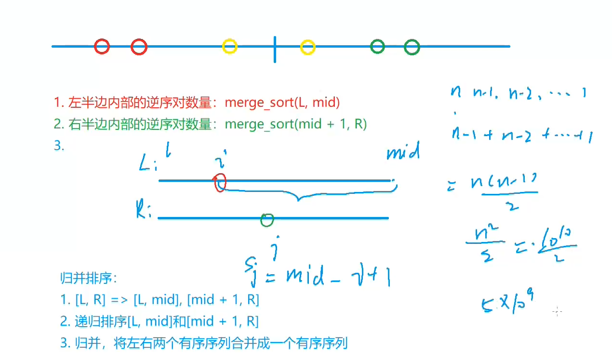

# AcWing 算法基础课 -- 基础算法

## AcWing 788. 逆序对的数量 

`难度：简单`

### 题目描述

给定一个长度为n的整数数列，请你计算数列中的逆序对的数量。

逆序对的定义如下：对于数列的第 i 个和第 j 个元素，如果满足 i < j 且 a[i] > a[j]，则其为一个逆序对；否则不是。

**输入格式**

第一行包含整数n，表示数列的长度。

第二行包含 n 个整数，表示整个数列。

**输出格式**

输出一个整数，表示逆序对的个数。

**数据范围**

$1≤n≤100000$

```r
输入样例：

6
2 3 4 5 6 1

输出样例：

5
```

### Solution

1. 分析左右两半部分，如果左半部分 q[i] 大于右半部分的 q[j]，那么从 i 到 mid 都可以和 j 组成逆序对，逆序对个数 res += mid - i + 1

```java
import java.util.*;
import java.io.*;

class Main{
    static int N = 100010;
    static long res = 0;
    static int[] q = new int[N];
    static int[] tmp = new int[N];
    public static void main(String[] args) throws IOException{
        BufferedReader br = new BufferedReader(new InputStreamReader(System.in));
        int n = Integer.parseInt(br.readLine());
        String[] s = br.readLine().split(" ");
        for(int i = 0; i < n; i++){
            q[i] = Integer.parseInt(s[i]);
        }
        
        mergeSort(0, n - 1);
        System.out.println(res);
    }
    public static void mergeSort(int l, int r){
        if(l >= r) return;
        int mid = l + r >> 1;
        mergeSort(l, mid);
        mergeSort(mid + 1, r);
        int k = 0, i = l, j = mid + 1;
        while(i <= mid && j <= r){
            if(q[i] <= q[j]) tmp[k++] = q[i++];
            else {
                res += mid - i + 1;
                tmp[k++] = q[j++];
            }
        }
        while(i <= mid) tmp[k++] = q[i++];
        while(j <= r) tmp[k++] = q[j++];
        for(i = l, j = 0; i <= r; i++, j++) q[i] = tmp[j]; 
    }
}
```

### yxc




这题是**归并排序的经典应用**：**在排序的过程中统计逆序对数量**。题面、样例和代码都在你上传的这份里。

你可以先把这题和上一题联系起来：

* 上一题：归并排序，目标是排好序
* 这一题：还是归并排序，但在“合并两个有序段”时，顺便统计逆序对

所以这题真正新增的内容只有一句：

**当左边某个数大于右边某个数时，可以一次性统计出一批逆序对。**

---

# 一、先弄清楚什么叫逆序对

题目定义是：

对于下标 `i < j`，如果 `a[i] > a[j]`，那么 `(i, j)` 是一个逆序对。

你先把它翻译成白话：

**前面的数比后面的数大。**

这就说明“顺序不对劲”。

---

## 例子 1

数组：

```text
1 2 3
```

这里没有任何逆序对，因为前面的都不大于后面的。

---

## 例子 2

数组：

```text
3 1 2
```

逆序对有：

* `(3,1)`
* `(3,2)`

一共 2 个。

因为：

* `3` 在前面，`1` 在后面，而且 `3 > 1`
* `3` 在前面，`2` 在后面，而且 `3 > 2`

---

## 题目样例

```text
6
2 3 4 5 6 1
```

答案是 `5`。

为什么？

因为最后那个 `1` 比前面的这 5 个数都小：

* `(2,1)`
* `(3,1)`
* `(4,1)`
* `(5,1)`
* `(6,1)`

一共 5 对。

---

# 二、这题如果暴力做，会怎样

最直接的方法是两层循环：

* 枚举前面的数
* 再枚举后面的数
* 判断是不是 `a[i] > a[j]`

伪代码大概是：

```java
for(int i = 0; i < n; i++){
    for(int j = i + 1; j < n; j++){
        if(a[i] > a[j]) res++;
    }
}
```

这样当然能做，但是时间复杂度是 **O(n²)**。

而题目 `n` 最大是 `100000`，这个规模下 `O(n²)` 会太慢。

所以要换更高效的方法。

---

# 三、为什么这题会想到归并排序

因为归并排序有一个特别好的性质：

**在合并两个有序段时，很容易判断“左边某些数”和“右边某个数”之间有多少逆序对。**

这题的关键不是“排序”本身，而是利用：

* 左半段已经有序
* 右半段已经有序

来快速统计逆序对。

---

# 四、这题最重要的核心结论

你一定要先记住这句话：

**如果在合并时发现 `q[i] > q[j]`，那么左半段从 `i` 到 `mid` 的所有元素，都和 `q[j]` 构成逆序对。**

所以可以一次加上：

```java
mid - i + 1
```

这就是题解里最核心的那句。

---

# 五、为什么能一次加 `mid - i + 1`

这是整题灵魂，我慢慢讲。

假设现在左右两段都已经有序：

```text
左边：2 3 4
右边：1 5 6
```

当前：

* `i` 指向左边的 `2`
* `j` 指向右边的 `1`

此时发现：

```text
2 > 1
```

因为左边已经有序，所以左边从 `i` 往后是：

```text
2 3 4
```

既然最前面的 `2` 都已经大于 `1` 了，那么后面的：

* `3`
* `4`

也一定都大于 `1`

所以 `1` 可以和左边当前剩下的所有数构成逆序对：

* `(2,1)`
* `(3,1)`
* `(4,1)`

一共 3 个。

这时候就不用一个个数了，直接加：

```java
mid - i + 1
```

如果 `i` 在左半段位置 0，`mid` 在位置 2，那么个数就是：

```java
2 - 0 + 1 = 3
```

---

# 六、先看完整代码

你上传的代码是：

```java
import java.util.*;
import java.io.*;

class Main{
    static int N = 100010;
    static long res = 0;
    static int[] q = new int[N];
    static int[] tmp = new int[N];
    public static void main(String[] args) throws IOException{
        BufferedReader br = new BufferedReader(new InputStreamReader(System.in));
        int n = Integer.parseInt(br.readLine());
        String[] s = br.readLine().split(" ");
        for(int i = 0; i < n; i++){
            q[i] = Integer.parseInt(s[i]);
        }
        
        mergeSort(0, n - 1);
        System.out.println(res);
    }
    public static void mergeSort(int l, int r){
        if(l >= r) return;
        int mid = l + r >> 1;
        mergeSort(l, mid);
        mergeSort(mid + 1, r);
        int k = 0, i = l, j = mid + 1;
        while(i <= mid && j <= r){
            if(q[i] <= q[j]) tmp[k++] = q[i++];
            else {
                res += mid - i + 1;
                tmp[k++] = q[j++];
            }
        }
        while(i <= mid) tmp[k++] = q[i++];
        while(j <= r) tmp[k++] = q[j++];
        for(i = l, j = 0; i <= r; i++, j++) q[i] = tmp[j]; 
    }
}
```

你会发现它和上一题归并排序模板几乎一模一样。
真正新增的关键只有这一段：

```java
else {
    res += mid - i + 1;
    tmp[k++] = q[j++];
}
```

---

# 七、先看 `main`

```java
public static void main(String[] args) throws IOException{
    BufferedReader br = new BufferedReader(new InputStreamReader(System.in));
    int n = Integer.parseInt(br.readLine());
    String[] s = br.readLine().split(" ");
    for(int i = 0; i < n; i++){
        q[i] = Integer.parseInt(s[i]);
    }
    
    mergeSort(0, n - 1);
    System.out.println(res);
}
```

它流程很简单：

1. 读入 `n`
2. 读入数组 `q`
3. 调用 `mergeSort(0, n - 1)`
4. 输出答案 `res`

这里和上一题不同的是：

* 这次不是输出排好序的数组
* 而是输出统计出来的逆序对个数 `res`

---

# 八、为什么 `res` 要定义成 `long`

代码里写的是：

```java
static long res = 0;
```

不是 `int`。

原因是逆序对数量可能很多。

最坏情况，比如数组完全降序：

```text
n, n-1, n-2, ..., 1
```

逆序对数量是：

```text
n * (n - 1) / 2
```

当 `n = 100000` 时，这个值会很大，超过 `int` 范围，所以必须用 `long`。

这个点很重要，你以后做计数题要有这个敏感度。

---

# 九、`mergeSort` 框架其实和上一题完全一样

```java
public static void mergeSort(int l, int r){
    if(l >= r) return;
    int mid = l + r >> 1;
    mergeSort(l, mid);
    mergeSort(mid + 1, r);
    ...
}
```

含义还是：

1. 区间长度 <= 1，直接返回
2. 拆成左右两半
3. 先递归处理左边
4. 再递归处理右边
5. 最后合并

这里你要意识到：

**逆序对统计发生在合并阶段，不是递归拆分阶段。**

---

# 十、核心：合并时怎么统计

代码是：

```java
int k = 0, i = l, j = mid + 1;
while(i <= mid && j <= r){
    if(q[i] <= q[j]) tmp[k++] = q[i++];
    else {
        res += mid - i + 1;
        tmp[k++] = q[j++];
    }
}
```

这段和普通归并排序相比，只多了：

```java
res += mid - i + 1;
```

---

## 情况 1：`q[i] <= q[j]`

```java
tmp[k++] = q[i++];
```

这说明左边当前元素不比右边大，不会形成逆序对。
所以只是正常把较小的 `q[i]` 放进 `tmp`。

---

## 情况 2：`q[i] > q[j]`

```java
res += mid - i + 1;
tmp[k++] = q[j++];
```

这说明出现逆序对了。

而且不是只有 `q[i]` 和 `q[j]` 这一对。

由于左半段已经有序，`q[i]` 后面的所有左边元素都 >= `q[i]`，因此它们也都 > `q[j]`。

所以可以直接一次性加上左边剩余元素个数：

```java
mid - i + 1
```

然后把较小的 `q[j]` 先放进 `tmp`。

---

# 十一、为什么这里要先放 `q[j]`

因为归并排序本质上还是要维持排序过程。

当 `q[i] > q[j]` 时，较小的是 `q[j]`，所以合并后的下一个位置应该放右边这个较小值：

```java
tmp[k++] = q[j++];
```

也就是说：

**我们一边排序，一边统计。**

不是只统计不排序。

---

# 十二、手动模拟一个关键例子

假设当前要合并的两段已经有序：

```text
左边：2 4 6
右边：1 3 5
```

初始：

* `i` 指向 `2`
* `j` 指向 `1`

---

## 第一步

比较：

```text
2 > 1
```

说明产生逆序对。

而左边从 `i` 到 `mid` 有：

```text
2 4 6
```

这 3 个数都大于 `1`，所以新增逆序对数量：

```java
res += 3
```

然后把 `1` 放入 `tmp`。

---

## 第二步

现在比较：

```text
2 <= 3
```

没有逆序对。

把 `2` 放入 `tmp`。

---

## 第三步

比较：

```text
4 > 3
```

说明左边当前剩余：

```text
4 6
```

都比 `3` 大。

所以新增：

```java
res += 2
```

然后把 `3` 放入 `tmp`。

---

## 第四步

比较：

```text
4 <= 5
```

无新增逆序对，放 `4`。

---

## 第五步

比较：

```text
6 > 5
```

左边当前剩余只有 `6` 一个，所以新增：

```java
res += 1
```

把 `5` 放入 `tmp`。

最后剩余 `6` 直接接上。

这次合并一共新增：

```text
3 + 2 + 1 = 6
```

这正是这两段之间的所有跨区间逆序对。

---

# 十三、这题到底统计了哪三类逆序对

从更完整的角度看，一个区间 `[l, r]` 的逆序对可以分成三类：

1. 左半段内部的逆序对
2. 右半段内部的逆序对
3. 左半段和右半段之间的逆序对

其中：

* 左半段内部的逆序对，靠 `mergeSort(l, mid)` 统计
* 右半段内部的逆序对，靠 `mergeSort(mid + 1, r)` 统计
* 跨左右两段的逆序对，靠“合并时”统计

这就是为什么递归 + 归并可以把整题做出来。

---

# 十四、和上一题“普通归并排序”相比，差别到底在哪

上一题普通归并排序的合并部分是：

```java
if(q[i] <= q[j]) tmp[k++] = q[i++];
else tmp[k++] = q[j++];
```

这题只是把 `else` 扩展成：

```java
else {
    res += mid - i + 1;
    tmp[k++] = q[j++];
}
```

所以你可以这样记：

**逆序对统计 = 归并排序 + 在右边更小时顺手加答案。**

这就是这题的模板本质。

---

# 十五、后面的两个 `while` 为什么不加逆序对

```java
while(i <= mid) tmp[k++] = q[i++];
while(j <= r) tmp[k++] = q[j++];
```

这里不需要再统计。

因为：

* 如果右边已经取完，左边剩余元素后面没有右边元素可比较了
* 如果左边已经取完，右边剩余元素也不会再和左边形成新的跨区间逆序对

真正会产生“跨左右两段逆序对”的时机，只在主循环比较 `q[i]` 和 `q[j]` 的时候。

---

# 十六、最后复制回原数组

```java
for(i = l, j = 0; i <= r; i++, j++) q[i] = tmp[j];
```

这和上一题一样，是把当前区间合并好的结果写回 `q`。

因为后面更高层的归并，还要依赖这段已经有序。

---

# 十七、你这题最该记住的结论

这题不是让你死背代码，而是至少记住下面这句：

**当 `q[i] > q[j]` 时，因为左半段有序，所以 `q[i..mid]` 都大于 `q[j]`，逆序对个数一次加 `mid - i + 1`。**

这句话一旦真正理解，这题基本就通了。

---

# 十八、给你一版适合学习的注释版

```java
import java.util.*;
import java.io.*;

class Main{
    static int N = 100010;
    static long res = 0;      // 逆序对总数，要用 long
    static int[] q = new int[N];
    static int[] tmp = new int[N];

    public static void main(String[] args) throws IOException{
        BufferedReader br = new BufferedReader(new InputStreamReader(System.in));

        int n = Integer.parseInt(br.readLine());
        String[] s = br.readLine().split(" ");

        for(int i = 0; i < n; i++){
            q[i] = Integer.parseInt(s[i]);
        }

        mergeSort(0, n - 1);

        System.out.println(res);
    }

    public static void mergeSort(int l, int r){
        // 区间长度 <= 1，没有逆序对
        if(l >= r) return;

        int mid = l + r >> 1;

        // 先递归处理左半边
        mergeSort(l, mid);

        // 再递归处理右半边
        mergeSort(mid + 1, r);

        // 开始合并两个有序段，并统计跨左右两段的逆序对
        int k = 0, i = l, j = mid + 1;

        while(i <= mid && j <= r){
            if(q[i] <= q[j]){
                // 不构成逆序对
                tmp[k++] = q[i++];
            }else{
                // q[i] > q[j]
                // 左边从 i 到 mid 的所有数都 > q[j]
                res += mid - i + 1;
                tmp[k++] = q[j++];
            }
        }

        // 把剩余元素放进 tmp
        while(i <= mid) tmp[k++] = q[i++];
        while(j <= r) tmp[k++] = q[j++];

        // 拷回原数组
        for(i = l, j = 0; i <= r; i++, j++){
            q[i] = tmp[j];
        }
    }
}
```

---

# 十九、这一题学完后，你应该能自己回答这 3 个问题

你可以试着自己复述：

1. 为什么暴力两层循环太慢？
2. 为什么归并时 `q[i] > q[j]` 能一次加 `mid - i + 1`？
3. 为什么 `res` 要用 `long`？

你能把这三个点讲清楚，这题就算真正理解了。

---

# 二十、这一题和前三题的关系

到目前为止你已经碰到三种很经典的“分治”思路了：

* 快速排序：划分
* 第 k 个数：划分后只递归一边
* 归并排序：合并
* 逆序对：在归并时顺手统计答案

你会发现，很多题其实不是全新算法，而是在经典模板上“加一点功能”。

这一题就是：

**归并排序模板 + 统计逆序对。**

下一步最合适的是：我把“归并排序”和“逆序对统计”两题放在一起，做一个**逐行对比讲解**。


# 这是个非常好的问题。
你现在问的其实不是“代码怎么写”，而是：

**面对“逆序对计数”这类题，怎么从题意想到归并排序？**

这个问题比背模板重要得多。

---

# 一、先说结论

想到归并排序，通常是因为你发现了这两个信号：

**1. 暴力做法是两层循环，时间复杂度 O(n²)，会超时**
**2. 题目本质是在统计“左边元素”和“右边元素”的关系，而且这种关系可以借助“有序”来批量统计**

这题正好同时满足这两个条件，所以很适合用归并排序。题解里也正是在合并左右两半时统计答案。

---

# 二、先从最朴素的想法开始

逆序对定义是：

* `i < j`
* `a[i] > a[j]`

最直接的想法一定是：

```java
for (每个 i)
    for (每个 j > i)
        判断 a[i] > a[j]
```

这就是暴力。

因为每一对都检查一次。

---

## 为什么这个思路不行

题目里 `n <= 100000`。

如果你用两层循环，复杂度大约是：

```text
n * n = 100000 * 100000 = 10^10
```

这个量太大了，肯定不行。

所以你立刻就应该有一个反应：

**不能一个一个数对地检查，必须想办法“成批统计”。**

这个“成批统计”就是关键转折点。

---

# 三、什么叫“成批统计”

你要数的是很多对 `(i, j)`。

如果还是：

* 找到一对，`res++`
* 再找到一对，`res++`

那就还是太慢。

更高效的方法应该是：

**一旦发现某种结构，就能一下子知道有一整批逆序对。**

比如不是加 1，而是直接加：

```java
res += 某一段元素个数
```

一旦你开始有这种想法，就已经在往归并排序靠了。

---

# 四、为什么“有序”能帮助批量统计

逆序对本质上是在问：

**左边有哪些数比右边某个数大？**

如果左边是乱的，你很难一下知道有多少个。

但如果左边已经有序了，就不一样了。

例如左边有序：

```text
2 4 6 8
```

右边当前一个数是：

```text
3
```

你一旦发现：

```text
4 > 3
```

因为左边是有序的，所以后面的：

```text
6 8
```

也一定都大于 `3`

这时你就不用一个个判断了，可以直接知道：

* `4` 和 `3`
* `6` 和 `3`
* `8` 和 `3`

这 3 个都是逆序对。

这就是“有序带来的批量统计能力”。

---

# 五、那为什么是归并排序，而不是别的排序

因为归并排序天然会做一件事：

**把数组分成左半边和右半边，并且在合并时，左右两边都已经各自有序。**

这正好满足我们刚才的需求：

* 左边有序
* 右边有序
* 需要统计左边和右边之间的大小关系

所以归并排序不是“为了排序而排序”，而是因为它的“合并两个有序段”这个过程，特别适合统计逆序对。

---

# 六、你可以这样建立“识别题型”的思路

当你看到这题时，可以按下面顺序想。

---

## 第一步：先想暴力

逆序对定义很直接，所以先想到：

* 枚举 `i`
* 枚举 `j`
* 判断 `a[i] > a[j]`

这是正常的。

---

## 第二步：看数据范围

`n = 100000`，暴力 O(n²) 不行。

所以必须优化。

---

## 第三步：问自己，优化空间在哪

我们在数的是“满足某种大小关系的数对”。

那就要想：

**能不能不是一个个比较，而是一次确定很多个？**

---

## 第四步：什么情况下能一次确定很多个

当一段数据是有序的时候。

因为有序就意味着：

* 发现一个满足条件
* 后面一整段也会满足条件

这时就能批量计数。

---

## 第五步：哪种经典算法会把问题拆成“两个有序段”

答案就是归并排序。

所以就想到：

**在归并排序合并左右两边时，顺便统计跨左右两边的逆序对。**

这就是完整的思考链。

---

# 七、这题最关键的“触发点”是什么

真正触发你想到归并排序的，不是“题目里有排序”这几个字。

而是这两个组合：

**大范围数据 + 数对关系统计**

更具体地说，是下面这种题型特征：

* 题目让你统计一类数对
* 条件和大小关系有关，比如 `a[i] > a[j]`
* 下标还有先后关系，比如 `i < j`
* 暴力枚举会超时
* 如果某一段有序，就可以批量统计

这种时候就很该想到归并排序。

---

# 八、为什么快排不如归并排序自然

你可能会想：
“快排也是分治，为什么不想到快排？”

因为这题最核心需求不是“把数组分开”，而是：

**在两个部分之间，稳定地统计大小关系。**

归并排序在合并时：

* 左边有序
* 右边有序
* 两边同时扫

特别适合统计“跨左右区间”的贡献。

而快排的划分过程更适合做：

* 排序
* 找第 k 小
* 按某个基准分块

但不太适合这种“精确统计左右之间所有满足条件的对数”。

所以逆序对这题，归并排序是非常自然的选择。

---

# 九、把这题再压缩成一句“经验判断”

你以后看到类似题，脑子里可以先冒出这句：

**如果题目是统计满足大小关系的数对，并且暴力会超时，就想想能不能在归并排序的合并过程中统计。**

这是一类很经典的套路。

---

# 十、这题里具体是怎么利用归并的

题解中的关键代码是：

```java
if(q[i] <= q[j]) tmp[k++] = q[i++];
else {
    res += mid - i + 1;
    tmp[k++] = q[j++];
}
```

意思是：

* 当 `q[i] <= q[j]`，不产生新的逆序对
* 当 `q[i] > q[j]`，因为左半段已经有序，所以从 `i` 到 `mid` 的所有数都大于 `q[j]`
* 所以一次加上 `mid - i + 1`

这就是“有序后批量统计”的具体体现。

---

# 十一、你现在最该学会的，不是死记“逆序对=归并排序”

不要把它背成机械结论：

```text
逆序对题 -> 一定归并排序
```

更好的理解是：

**因为归并时两边有序，所以可以批量统计跨区间逆序对。**

你要记住的是这个原因。

这样以后题目稍微变形，你也还能认出来。

---

# 十二、给你一个最实用的判断模板

以后你做题时，可以这样问自己：

### 1

这题暴力是不是要枚举很多对元素？

### 2

数据范围是不是不允许 O(n²)？

### 3

如果一部分数据有序，我能不能一次统计很多答案？

### 4

有没有一种算法会自然产生“两个有序段”？

如果前三个你都答“是”，第四个通常就会指向：

**归并排序。**

---

# 十三、这一题你可以这样记忆

不是记：

**“逆序对要用归并排序。”**

而是记：

**“逆序对之所以能用归并排序，是因为归并时左右两边有序，能一次统计一整批满足条件的数对。”**

这就是真正的理解。

---

# 十四、给你一个一句话版总结

**想到归并排序，是因为暴力统计逆序对太慢，而归并时左右两段有序，可以把很多逆序对一次性统计出来。**

---

如果你愿意，我下一步可以专门给你讲一个内容：
**“什么题型该想到归并排序，什么题型该想到快速排序”**。这对你建立题感很有帮助。

```java
import java.io.BufferedReader;
import java.io.IOException;
import java.io.InputStreamReader;

public class Main {
    static int N = 100010;
    static int[] q = new int[N];
    static int[] temp = new int[N];
    //逆序对数量可能超出int范围
    static long count = 0;
    static int n = 0;

    public static void main(String[] args) throws IOException {
        BufferedReader bufferedReader = new BufferedReader(new InputStreamReader(System.in));
        n = Integer.parseInt(bufferedReader.readLine());
        String[] s = bufferedReader.readLine().split(" ");
        for (int i = 0; i < n; i++) {
            q[i] = Integer.parseInt(s[i]);
        }

        mergeSort(0, n - 1);
        System.out.println(count);
    }

    public static void mergeSort(int l, int r) {
        if (l >= r) return;
        int mid = l + r >> 1;
        mergeSort(l, mid);
        mergeSort(mid + 1, r);
        int k = 0, i = l, j = mid + 1;
        while (i <= mid && j <= r){
            // >= 不符合逆序对定义，需要写成 >
            if (q[i] > q[j]){
                temp[k++] = q[j++];
                count = count + (mid - i + 1);
            }else{
                temp[k++] = q[i++];
            }
        }
        while (i <= mid){
            temp[k++] = q[i++];
        }
        while (j <= r) {
            temp[k++] = q[j++];
        }
        for (k = 0, i = l; i <= r; i++, k++){
            q[i] = temp[k];
        }

    }
}
```