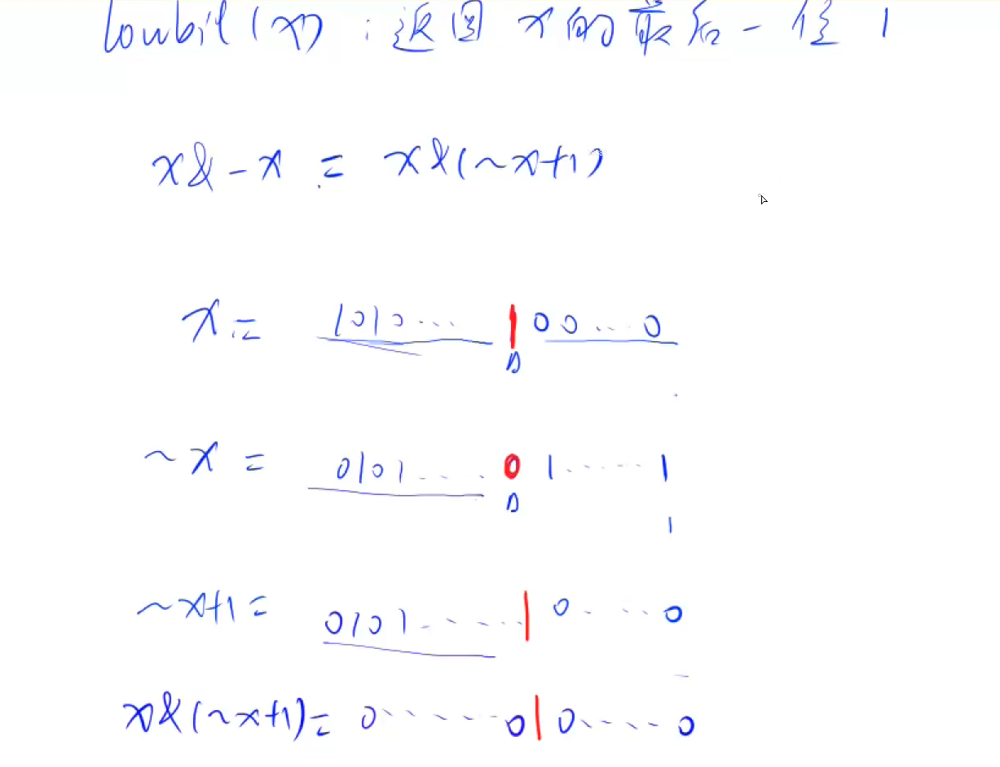
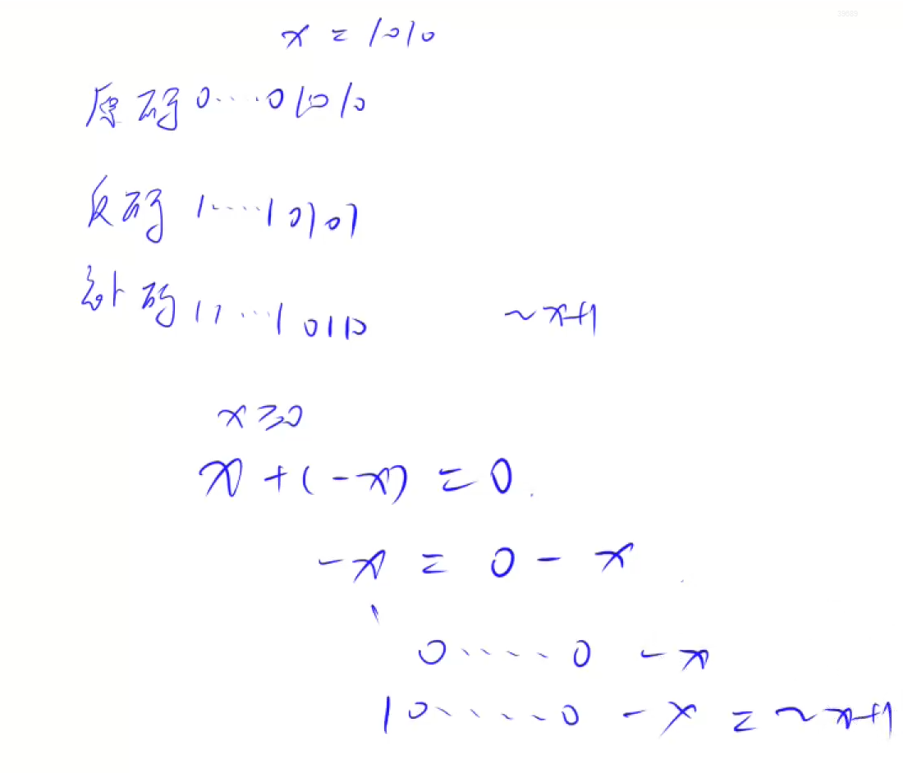

# AcWing 算法基础课 -- 基础算法

## AcWing 801. 二进制中1的个数 

`难度：简单`

### 题目描述

给定一个长度为n的数列，请你求出数列中每个数的二进制表示中1的个数。

**输入格式**

第一行包含整数n。

第二行包含n个整数，表示整个数列。

**输出格式**

共一行，包含n个整数，其中的第 i 个数表示数列中的第 i 个数的二进制表示中1的个数。

```r
数据范围

1≤n≤100000,
0≤数列中元素的值≤109

输入样例：

5
1 2 3 4 5

输出样例：

1 1 2 1 2
```

### Solution

1. 求 n 的第 k 为数字： `n >> k & 1`
2. 返回 x 的最后一位 1：lowbit(x)原理：`x & -x`;x & -x 其实就是 x & (~x + 1)`
3. 补码为什么是 `~x + 1`
```r
x + (-x) = 0
-x = 0 - x
-x =  000...000 - x
-x = 1000...000 - x
-x = ~x + 1
```

```java
import java.util.*;
import java.io.*;

public class Main{
    public static void main(String[] args) throws IOException{
        BufferedReader in = new BufferedReader(new InputStreamReader(System.in));
        BufferedWriter out = new BufferedWriter(new OutputStreamWriter(System.out));
        int n = Integer.parseInt(in.readLine());
        String[] s = in.readLine().split(" ");
        
        for(int i = 0; i < n; i++){
            int x = Integer.parseInt(s[i]);
            int res = 0;
            while(x > 0) {
                // lowbit 操作
                // x = x - (x & -x);
                t &= (t - 1);
                res++;
            }
            out.write(res + " ");
            out.flush();
            // System.out.print(res + " ");
        }
        
    }
}
```

### yxc

1. lowbit操作



2. 原码反码补码



你好！我是你的算法辅导老师。看到你上传了第一讲“基础算法”中的位运算经典题目——**二进制中1的个数**。

这道题非常经典，是理解计算机底层运作和位运算的绝佳切入点。你的笔记做得很清晰，不仅记录了两种常用的位运算技巧，还涉及了原码、反码和补码的概念。不过，你提供的 Java 代码中有一个小小的笔误，我们接下来会一起梳理并修正它。

让我们按照循序渐进的步骤，把这道题彻底吃透。

---

### 一、 题型与核心考点

* **所属类型：** 基础算法 — 位运算。
* **核心考点：** 给定一个整数序列，要求快速求出每个整数的二进制表示中有多少个 1。
* **时间要求：** 数据范围 $n \le 100000$，这就要求我们在处理每个数字时，时间复杂度必须足够低（最好是 $O(1)$ 或 $O(k)$，其中 $k$ 是数字中 1 的个数），否则整体操作容易超时。

### 二、 解法思路与整体框架

想要数出一个数字二进制中有几个 1，最直观的朴素想法是：把数字不断向右移位（`x >> 1`），然后看最后一位是不是 1（`x & 1`）。这种方法需要循环 32 次（针对 32 位整数）。

但我们有更聪明的优化做法——**只跳到有 1 的地方去扣除它**。这里有两个非常经典的位运算技巧：

#### 1. Lowbit 操作：`x & -x`
这个操作的作用是：**提取出一个数字二进制表示中的最后一位 1（连同它后面的 0）**。
* **原理：** 在计算机中，负数使用补码表示。`-x` 等价于 `~x + 1`（按位取反再加一）。
    * 例如 `x = 10`，二进制是 `1010`。
    * `~x` 是 `0101`。
    * `~x + 1` 就是 `0110`（也就是 `-x`）。
    * 此时将 `x` 和 `-x` 做与运算（`&`）：`1010 & 0110 = 0010`。我们成功提取出了最右边的 `1`！
* **如何统计：** 每次找到最后一个 1 所代表的数值，把它从原数中减去（`x = x - lowbit(x)`），减了多少次才把数变成 0，就说明有几个 1。

#### 2. 消去最低位的 1：`x & (x - 1)`
这也是一种非常常见的方法。
* **原理：** `x - 1` 会把 `x` 二进制最右边的 1 变成 0，并且把那个 1 右边所有的 0 都变成 1。
* 将 `x` 与 `x - 1` 做与运算（`x & (x - 1)`），刚好可以把最右边的 1 直接抹掉。

---

### 三、 实现与细节 (Java 代码解析)

你提供的笔记中，已经搭好了非常棒的快读快写框架（`BufferedReader` 和 `BufferedWriter`），这在处理 100000 级别的数据输入时非常有效。

但在核心逻辑部分，有一处代码混合了变量：
```java
// 你的原笔记代码片段
int res = 0;
while(x > 0) {
    // lowbit 操作
    // x = x - (x & -x);
    t &= (t - 1); // 这里报错：t 未定义，且逻辑没有作用在 x 上
    res++;
}
```

下面我们来修正它，并给出两种标准写法的对比：

#### 写法一：基于 Lowbit 原理 (推荐，后续树状数组会用到)
```java
import java.util.*;
import java.io.*;

public class Main {
    public static void main(String[] args) throws IOException {
        BufferedReader in = new BufferedReader(new InputStreamReader(System.in));
        BufferedWriter out = new BufferedWriter(new OutputStreamWriter(System.out));
        
        int n = Integer.parseInt(in.readLine());
        String[] s = in.readLine().split(" ");
        
        for(int i = 0; i < n; i++) {
            int x = Integer.parseInt(s[i]);
            int res = 0;
            // 当 x 不为 0 时持续操作
            while(x > 0) {
                // 每次减去最后一位 1 所代表的值
                x = x - (x & -x); 
                res++;
            }
            out.write(res + " ");
        }
        out.flush(); // 别忘了最后刷新缓冲区
    }
}
```

#### 写法二：基于 `x & (x - 1)` (你在代码里想表达的另一种写法)
```java
// 在 while 循环内部替换为：
while(x > 0) {
    x &= (x - 1); // 直接抹掉最后一个 1
    res++;
}
```
**边界处理细节：** 由于题目数据范围规定元素值 $\ge 0$，所以 `while (x > 0)` 是安全的。如果题目有可能包含负数，应该写成 `while (x != 0)`，以免负数在 Java 中被判定为 `< 0` 而跳出循环。

---

### 四、 为什么能想到这种解法？（方法总结与举一反三）

很多初学者在看懂 `x & -x` 或 `x & (x - 1)` 后，会感叹“这怎么想出来的”。其实，**我们不需要去“发明”它，而是要“识别”它。**

1.  **触发信号：** 当你在题目中看到“二进制”、“统计 1 的个数”、“位运算”等字眼时，你的脑海中应该立刻弹出这两组工具库：
    * **取第 k 位：** `n >> k & 1`
    * **处理最低位的 1：** `x & -x` 或 `x & (x - 1)`
2.  **化归思想：** 朴素做法是遍历 32 位，时间复杂度是严格的 32 次。而优化做法的本质是**“跳跃式遍历”**。数字里有几个 1，循环就只执行几次。这是一种基于结果去削减过程的贪心思维。
3.  **举一反三 (迁移)：**
    * **判断 2 的幂：** 如果一个数是 2 的整数次方（如 2, 4, 8, 16），它的二进制有且仅有一个 1。怎么判断最快？直接 `if ((x & (x - 1)) == 0)` 即可！
    * **树状数组 (Fenwick Tree)：** 第二讲数据结构里的高级内容。树状数组的核心索引跳转机制，就是完全依赖 `lowbit(x)` 来实现的。这道题实际上是在为后面的高级数据结构打地基。

---

你对这两种消除 `1` 的逻辑理解得还清晰吗？如果这部分没有疑问，**你想先尝试自己敲一遍修正后的代码，还是希望我继续为你讲解目录中的下一部分（例如数据结构或二分算法）呢？**

```java
import java.io.BufferedReader;
import java.io.IOException;
import java.io.InputStreamReader;
class Main {
    public static void main(String[] args) throws IOException {
        BufferedReader bufferedReader = new BufferedReader(new InputStreamReader(System.in));
        String[] s1 = bufferedReader.readLine().split(" ");
        int n = Integer.parseInt(s1[0]);
        int[] arr = new int[n];
        String[] s2 = bufferedReader.readLine().split(" ");
        for (int i = 0; i < n; i++) {
            arr[i] = Integer.parseInt(s2[i]);
        }
        for (int i = 0; i < n; i++) {
            count(0, arr[i]);
        }

    }
    public static void count(int count, int c){
        while (c != 0){
            if (c % 2 == 1) count++;
            c /= 2;
        }
        System.out.print(count + " ");
    }

}
```