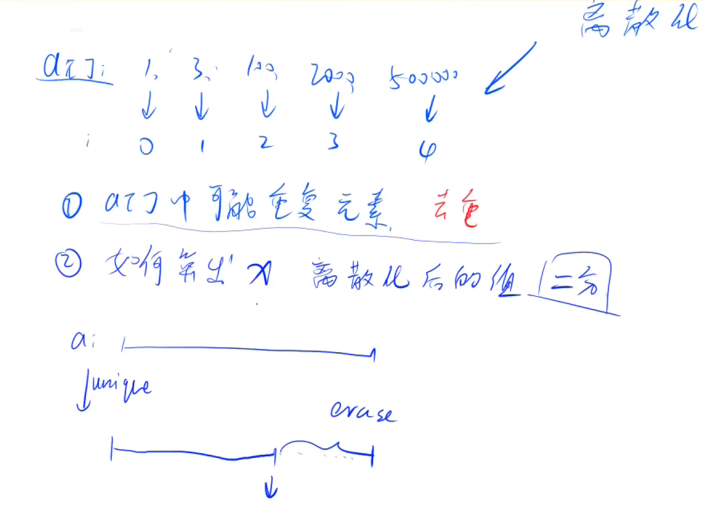

# AcWing 算法基础课 -- 基础算法

## AcWing 802. 区间和 

`难度：简单`

### 题目描述

假定有一个无限长的数轴，数轴上每个坐标上的数都是0。

现在，我们首先进行 n 次操作，每次操作将某一位置x上的数加c。

接下来，进行 m 次询问，每个询问包含两个整数l和r，你需要求出在区间[l, r]之间的所有数的和。

**输入格式**

第一行包含两个整数n和m。

接下来 n 行，每行包含两个整数x和c。

再接下里 m 行，每行包含两个整数l和r。

**输出格式**

共m行，每行输出一个询问中所求的区间内数字和。

数据范围

$ −10^9≤x≤10^9,$
$ 1≤n,m≤10^5,$
$ −10^9≤l≤r≤10^9,$
$ −10000≤c≤10000$
```r
输入样例：

3 3
1 2
3 6
7 5
1 3
4 6
7 8

输出样例：

8
0
5
```

### Solution

1. 用题目中会用到的数字最多有 3 * 10^5，可以用来离散化表示 10^9
2. alls 存所有用到的下标，adds 存所有添加操作，querys 存所有查询操作
3. a 存执行添加操作之后的下标的值，q 存前缀和

用二维数组代替 Pairs，用数组代替 List，速度快了一倍

```java
import java.util.*;
import java.io.*;

class Main{
    static final int N = 100010;
    static int[] a = new int[3 * N];
    static int[] q = new int[3 * N];
    static int[][] adds = new int[N][2];
    static int[][] querys = new int[N][2];
    static int[] alls = new int[3 * N];
    public static int unique(int[] alls, int n){
        // 双指针
        int j = 0;
        for(int i = 0; i < n; i++){
            if(i == 0 || alls[i] != alls[i - 1]){
                alls[j] = alls[i];
                j++;
            }
        }
        return j;
    }
    public static int bsearch(int[] alls, int n, int x){
        int low = 0, high = n - 1;
        while(low <= high){
            int mid = low + high >> 1;
            if(alls[mid] > x) high = mid - 1;
            else if(alls[mid] < x) low = mid + 1;
            else return mid + 1;
        }
        return low;
    }
    public static void main(String[] args) throws IOException{
        BufferedReader br = new BufferedReader(new InputStreamReader(System.in));
        BufferedWriter bw = new BufferedWriter(new OutputStreamWriter(System.out));
        String[] s = br.readLine().split(" ");
        int n = Integer.parseInt(s[0]);
        int m = Integer.parseInt(s[1]);
        // 下标
        int idx = 0, idx1 = 0;
        // 存插入
        for(int i = 0; i < n; i++){
            s = br.readLine().split(" ");
            int x = Integer.parseInt(s[0]);
            int c = Integer.parseInt(s[1]);
            alls[idx++] = x;
            adds[i][0] = x;
            adds[i][1] = c;
        }
        for(int i = 0; i < m; i++){
            s = br.readLine().split(" ");
            int l = Integer.parseInt(s[0]);
            int r = Integer.parseInt(s[1]);
            alls[idx++] = l;
            alls[idx++] = r;
            querys[i][0] = l;
            querys[i][1] = r;
        }
        // alls(0, idx - 1) 排序
        Arrays.sort(alls, 0, idx);
        // 去重
        int end = unique(alls, idx);
        // 添加操作
        for(int i = 0; i < n; i++){
            // 二分查找找到 x 在 alls 数组中的下标
            int t = bsearch(alls, end, adds[i][0]);
            a[t] += adds[i][1];
        }
        // 计算前缀和
        for(int i = 1; i <= end; i++){
            q[i] = q[i - 1] + a[i];
        }
        for(int i = 0; i < m; i++){
            int l = bsearch(alls, end, querys[i][0]);
            int r = bsearch(alls, end, querys[i][1]);
            bw.write(q[r] - q[l - 1] + "\n");
        }
        bw.close();
        br.close();
        
    }
}
```

用了 List 和 Pairs，效率不高

```java
import java.util.*;
import java.io.*;

public class Main{
    static class Pairs{
        int first, second;
        public Pairs(int first, int second){
            this.first = first;
            this.second = second;
        }
    }
    public static void main(String[] args) throws IOException{
        BufferedReader in = new BufferedReader(new InputStreamReader(System.in));
        BufferedWriter out = new BufferedWriter(new OutputStreamWriter(System.out));
        String[] s = in.readLine().split(" ");
        int n = Integer.parseInt(s[0]);
        int m = Integer.parseInt(s[1]);
        // 数据范围为 10 的 9 次方,如果直接一个数组来存,空间就会超出限制
        // 但是操作数和查询数只有 10 的 5 次方
        // 想到用离散化的方式,用 10 的 5 次方的长度表示 10 的 9 次方的量级
        // 申请的数组长度 n + m + m + 10 就可以,加个 10 防止边界问题
        int N = n + m + m + 10;
        // a[] 去重,离散化之后的数组
        int[] a = new int[N];
        // p[] a的前缀和
        int[] p = new int[N];
        // adds 记录添加操作
        List<Pairs> adds = new ArrayList<>();
        // querys 记录查询操作
        List<Pairs> querys = new ArrayList<>();
        // alls 记录所有在数轴上出现过的坐标
        List<Integer> alls = new ArrayList<>();
        for(int i = 0; i < n; i++){
            s = in.readLine().split(" ");
            int x = Integer.parseInt(s[0]);
            int c = Integer.parseInt(s[1]);
            adds.add(new Pairs(x, c));
            alls.add(x);
        }
        
        for(int i = 0; i < m; i++){
            s = in.readLine().split(" ");
            int l = Integer.parseInt(s[0]);
            int r = Integer.parseInt(s[1]);
            
            querys.add(new Pairs(l, r));
            alls.add(l);
            alls.add(r);
        }
        // 排序
        Collections.sort(alls);
        // 去重
        int end = unique(alls);
        alls = alls.subList(0, end);

        // 离散化,就是找到要插入或者查询的数字在 alls 的位置
        // 可以用二分查找
        // 插入
        // 返回值以 1 开始计数
        for(int i = 0; i < n; i++){
            int index = bsearch(adds.get(i).first, alls);
            a[index] += adds.get(i).second;
        }

        // 计算前缀和
        for(int i = 1; i < N; i++){
            p[i] = p[i - 1] + a[i];
        }

        // 开始查询输出
        for(int i = 0; i < m; i++){
            int l = bsearch(querys.get(i).first, alls);
            int r = bsearch(querys.get(i).second, alls);
            int res = p[r] - p[l - 1];
            out.write(res + "\n");
            out.flush();
        }
    }
    public static int unique(List<Integer> list){
        int j = 0;
        for(int i = 0; i < list.size(); i++){
            if(i == 0 || list.get(i) != list.get(i - 1)){
                list.set(j, list.get(i));
                j++;
            }
        }
        return j;
    }
    public static int bsearch(int x, List<Integer> list){
        int l = 0, r = list.size() - 1;
        while(l <= r){
            int mid = l + r >> 1;
            if(list.get(mid) > x) r = mid - 1;
            else if(list.get(mid) < x) l = mid + 1;
            else return mid + 1;
        }
        return 1;
    }
}
```

### yxc

1. 离散化




这题是**基础算法里的“离散化 + 前缀和 + 二分”综合题**。
核心考点非常典型：**数轴范围特别大，但真正用到的位置很少**，所以不能直接开大数组，要先把“会出现的坐标”压缩成连续下标，再做前缀和回答区间查询。

也就是说，这题在你的学习目录里，主要对应：

* 第一讲基础算法里的 **前缀和**
* 第一讲基础算法里的 **离散化**
* 以及一个配套工具：**二分查找**。

---

# 一、先判断题型与核心考点

## 1. 这题属于什么类型？

这是一个经典的：

**“离散化后做区间和查询”** 题。

题目表面是在无限长数轴上操作，但实际上：

* 一共只有 `n` 次加法操作
* 一共只有 `m` 次查询
* 真正有意义的坐标，最多只会出现在：

  * 所有加法操作的 `x`
  * 所有查询的 `l`
  * 所有查询的 `r`

所以虽然坐标范围到了 `[-1e9, 1e9]`，但真正要关心的点数只有大约 `n + 2m` 个，最多 `3 * 10^5`。这正是离散化的标准信号。

---

## 2. 核心做法是什么？

核心流程分成四步：

### 第一步：收集所有会用到的坐标

把下面这些数全塞进 `alls`：

* 每次修改的 `x`
* 每次查询的 `l`
* 每次查询的 `r`

### 第二步：排序 + 去重

把这些真实坐标映射成一个连续的下标区间，比如：

* `-1000000000 -> 1`
* `1 -> 2`
* `3 -> 3`
* `7 -> 4`

这就叫**离散化**。

### 第三步：把加法操作加到离散后的数组里

原本是“在坐标 `x` 处加 `c`”，
现在变成“在离散下标 `index(x)` 处加 `c`”。

### 第四步：做前缀和

设 `q[i]` 表示离散数组前 `i` 项和，那么：

区间 `[l, r]` 的答案就是：

`q[index(r)] - q[index(l) - 1]`

---

# 二、为什么不能直接做？

## 1. 朴素做法

最直观的想法是：

* 开一个数组 `arr`
* `arr[x] += c`
* 查询时把 `[l, r]` 全加起来

但这里坐标能到 `10^9`，根本没法直接开数组。

而且坐标还有负数，更麻烦。

---

## 2. 优化做法

优化点就在于：

**我们不关心没出现过的位置。**

因为题目只会问有限次区间，而且加法也只发生在有限个点上。
所以只需要保留“关键坐标”。

这就是离散化的本质：

> 用一个较小的连续下标集合，代替原来范围极大但稀疏的坐标集合。

---

# 三、整体思路拆解

下面我按你这份题解里的写法，一步一步讲。

---

## 1. 数据结构分别存什么？

你代码里有这些数组：

```java
static int[] a = new int[3 * N];
static int[] q = new int[3 * N];
static int[][] adds = new int[N][2];
static int[][] querys = new int[N][2];
static int[] alls = new int[3 * N];
```

分别表示：

* `alls`：存所有会出现的坐标，后面拿来排序、去重、离散化
* `adds[i] = {x, c}`：记录第 `i` 次加法操作
* `querys[i] = {l, r}`：记录第 `i` 次查询
* `a[i]`：离散后第 `i` 个位置上的值
* `q[i]`：`a` 的前缀和

---

## 2. 为什么 `alls` 要同时存 `x`、`l`、`r`？

这一步非常关键。

很多初学者会想：
“我只需要把修改位置 `x` 离散化就够了吧？”

其实不够。

因为查询时你要查的是 `[l, r]`，而前缀和查询需要知道：

* `l` 对应的离散位置
* `r` 对应的离散位置

所以：

* 修改点 `x` 必须加入 `alls`
* 查询边界 `l`、`r` 也必须加入 `alls`

这样以后才能对所有需要访问的位置统一映射。

---

# 四、排序与去重

## 1. 排序

```java
Arrays.sort(alls, 0, idx);
```

这里只排真正填进去的前 `idx` 个数。

---

## 2. 去重

```java
public static int unique(int[] alls, int n){
    int j = 0;
    for(int i = 0; i < n; i++){
        if(i == 0 || alls[i] != alls[i - 1]){
            alls[j] = alls[i];
            j++;
        }
    }
    return j;
}
```

这个函数做的事情是：

把排好序的数组原地去重，并返回去重后的长度 `j`。

### 例子

假设排序后：

```java
alls = [1, 1, 3, 3, 7]
```

去重后前面变成：

```java
alls = [1, 3, 7, ...]
```

返回 `3`。

### 为什么排序后才能这样去重？

因为相同元素会挨在一起，判断当前元素是否和前一个元素相等即可。

---

# 五、离散化映射怎么做？

## 1. bsearch 的作用

```java
public static int bsearch(int[] alls, int n, int x){
    int low = 0, high = n - 1;
    while(low <= high){
        int mid = low + high >> 1;
        if(alls[mid] > x) high = mid - 1;
        else if(alls[mid] < x) low = mid + 1;
        else return mid + 1;
    }
    return low;
}
```

这个函数的目标是：

**找到原坐标 `x` 在离散数组 `alls` 里的位置。**

注意你这里返回的是 `mid + 1`，也就是说：

> 离散后的下标从 `1` 开始，而不是从 `0` 开始。

这样做是为了后面前缀和更方便，因为：

```java
q[i] = q[i - 1] + a[i]
```

若从 1 开始，`q[0]` 自然就是 0，写区间和最顺手。

---

## 2. 为什么一定能找到？

因为你之前已经保证：

* 所有修改的 `x` 都加入了 `alls`
* 所有查询的 `l`、`r` 都加入了 `alls`

所以真正调用 `bsearch` 的值，理论上都能在 `alls` 中找到。

---

## 3. 这里的 `return low` 要注意

你的这份代码里，`return low` 在这题里**基本不会被用到**，因为传进去的值都在 `alls` 里。
但从代码风格上说，更严谨的写法可以直接写成“查精确值”的版本，或者统一写成“找第一个大于等于 `x` 的位置再 +1”。

更标准一点我建议写成：

```java
static int find(int x, int[] alls, int len) {
    int l = 0, r = len - 1;
    while (l < r) {
        int mid = (l + r) >> 1;
        if (alls[mid] >= x) r = mid;
        else l = mid + 1;
    }
    return l + 1;
}
```

因为离散化本质上就是找坐标的位置，这种写法更统一。

---

# 六、添加操作是怎么映射的？

```java
for(int i = 0; i < n; i++){
    int t = bsearch(alls, end, adds[i][0]);
    a[t] += adds[i][1];
}
```

意思是：

* 原来要在真实坐标 `x` 上加 `c`
* 现在先找到 `x` 离散后的编号 `t`
* 然后在 `a[t]` 上加 `c`

### 举个例子

如果离散后：

```java
alls = [1, 3, 7]
```

对应关系是：

* `1 -> 1`
* `3 -> 2`
* `7 -> 3`

那么输入：

```java
1 2
3 6
7 5
```

就会变成：

```java
a[1] += 2
a[2] += 6
a[3] += 5
```

所以：

```java
a = [0, 2, 6, 5]
```

---

# 七、前缀和怎么做？

```java
for(int i = 1; i <= end; i++){
    q[i] = q[i - 1] + a[i];
}
```

这里：

* `q[i]` 表示离散数组前 `i` 个位置的总和

延续刚才例子：

```java
a[1] = 2
a[2] = 6
a[3] = 5
```

那么：

```java
q[1] = 2
q[2] = 8
q[3] = 13
```

---

# 八、查询为什么能直接用前缀和？

```java
for(int i = 0; i < m; i++){
    int l = bsearch(alls, end, querys[i][0]);
    int r = bsearch(alls, end, querys[i][1]);
    bw.write(q[r] - q[l - 1] + "\n");
}
```

对于每个查询 `[l, r]`：

1. 找到 `l` 的离散位置
2. 找到 `r` 的离散位置
3. 用前缀和求和

公式：

```java
sum(l, r) = q[r] - q[l - 1]
```

---

## 样例怎么理解？

输入：

```java
3 3
1 2
3 6
7 5
1 3
4 6
7 8
```

加法操作后，数轴上非零点只有：

* `1 -> 2`
* `3 -> 6`
* `7 -> 5`

### 查询 1：`[1, 3]`

包含位置 1 和 3：

* `2 + 6 = 8`

### 查询 2：`[4, 6]`

这里没有任何加过的点：

* `0`

### 查询 3：`[7, 8]`

只包含位置 7：

* `5`

和样例输出一致。

---

# 九、时间复杂度和空间复杂度

## 时间复杂度

设总共收集到的坐标数为 `k = n + 2m`。

### 主要部分：

* 排序：`O(k log k)`
* 去重：`O(k)`
* 每次修改二分：`O(n log k)`
* 每次查询二分：`O(m log k)`
* 前缀和：`O(k)`

所以总复杂度：

**O((n + m) log(n + m))**

这对 `10^5` 规模完全可以通过。

---

## 空间复杂度

主要是几个数组：

**O(n + m)**

---

# 十、Java 实现细节

这题的 Java 细节很重要，我专门讲一下。

## 1. 为什么数组版比 `List + Pair` 更快？

你题解里也提到了：

* 用二维数组代替 `Pair`
* 用数组代替 `List`

速度会更快。

原因主要有：

### 原因一：对象开销

`new Pair(...)` 会创建很多对象，Java 对象有额外内存和访问成本。

### 原因二：`ArrayList<Integer>` 有装箱拆箱

`int` 会变成 `Integer`，有额外开销。

### 原因三：数组连续存储，更快

原生数组访问更直接。

所以在 AcWing 这种偏性能的平台上，数组版通常更稳。

---

## 2. `mid = low + high >> 1` 有没有问题？

在 Java 里，这句等价于：

```java
mid = (low + high) >> 1;
```

因为 `+` 优先级高于 `>>`。

虽然没错，但为了可读性，更推荐写成：

```java
int mid = (low + high) >> 1;
```

这样更清楚。

---

## 3. 为什么前缀和数组从 1 开始？

这是竞赛里很常见的写法：

* `a[1]` 开始存值
* `q[0] = 0`
* 区间和统一写成 `q[r] - q[l - 1]`

这样不容易写错边界。

---

## 4. 输入输出为什么要用 `BufferedReader/Writer`？

因为数据量较大，普通 `Scanner` 可能会慢。
竞赛题里一般优先考虑 `BufferedReader + split`，或者更快的手写快读。

---

# 十一、这份代码里有哪些容易出错的点？

## 1. 忘记把 `l` 和 `r` 放进 `alls`

这是最常见错误之一。
只放修改点，不放查询边界，会导致查询映射不完整。

---

## 2. 去重后忘记更新有效长度

```java
int end = unique(alls, idx);
```

后面所有二分、前缀和，都应该只在前 `end` 个有效元素里做。

---

## 3. 离散下标是从 1 开始还是 0 开始没统一

你的代码里是**从 1 开始**。
那就要保证：

* `bsearch` 返回 `mid + 1`
* 前缀和从 `1` 开始算
* 查询用 `q[r] - q[l - 1]`

这三处必须统一。

---

## 4. `bsearch` 写错返回值

你第二份 `List` 版本代码里：

```java
return 1;
```

这个写法其实不严谨。
如果没找到，不应该固定返回 1。虽然这题因为都已加入 `alls`，通常不会出问题，但从逻辑上讲是危险的。

---

## 5. 前缀和遍历长度写太大

数组很大没关系，但逻辑上最好只遍历到离散后的有效长度：

```java
for (int i = 1; i <= end; i++)
```

这样更清晰。

---

# 十二、给你一个更规范的 Java 版本

下面我给你一个更适合初学者理解、也比较标准的版本。

```java
import java.io.*;
import java.util.*;

public class Main {
    static final int N = 300010;

    static int[] alls = new int[N];
    static int[][] adds = new int[100010][2];
    static int[][] queries = new int[100010][2];
    static int[] a = new int[N];
    static int[] s = new int[N];

    // 去重，返回去重后的长度
    static int unique(int[] arr, int len) {
        int j = 0;
        for (int i = 0; i < len; i++) {
            if (i == 0 || arr[i] != arr[i - 1]) {
                arr[j++] = arr[i];
            }
        }
        return j;
    }

    // 找到 x 在离散数组中的位置（返回值从 1 开始）
    static int find(int x, int[] arr, int len) {
        int l = 0, r = len - 1;
        while (l < r) {
            int mid = (l + r) >> 1;
            if (arr[mid] >= x) r = mid;
            else l = mid + 1;
        }
        return l + 1;
    }

    public static void main(String[] args) throws Exception {
        BufferedReader br = new BufferedReader(new InputStreamReader(System.in));
        BufferedWriter bw = new BufferedWriter(new OutputStreamWriter(System.out));

        String[] first = br.readLine().split(" ");
        int n = Integer.parseInt(first[0]);
        int m = Integer.parseInt(first[1]);

        int idx = 0;

        // 读入修改
        for (int i = 0; i < n; i++) {
            String[] str = br.readLine().split(" ");
            int x = Integer.parseInt(str[0]);
            int c = Integer.parseInt(str[1]);

            adds[i][0] = x;
            adds[i][1] = c;
            alls[idx++] = x;
        }

        // 读入查询
        for (int i = 0; i < m; i++) {
            String[] str = br.readLine().split(" ");
            int l = Integer.parseInt(str[0]);
            int r = Integer.parseInt(str[1]);

            queries[i][0] = l;
            queries[i][1] = r;
            alls[idx++] = l;
            alls[idx++] = r;
        }

        // 排序
        Arrays.sort(alls, 0, idx);

        // 去重
        int len = unique(alls, idx);

        // 处理修改：将原坐标映射到离散坐标
        for (int i = 0; i < n; i++) {
            int x = adds[i][0];
            int c = adds[i][1];
            int pos = find(x, alls, len);
            a[pos] += c;
        }

        // 前缀和
        for (int i = 1; i <= len; i++) {
            s[i] = s[i - 1] + a[i];
        }

        // 回答查询
        for (int i = 0; i < m; i++) {
            int l = find(queries[i][0], alls, len);
            int r = find(queries[i][1], alls, len);
            bw.write((s[r] - s[l - 1]) + "\n");
        }

        bw.flush();
        bw.close();
        br.close();
    }
}
```

---

# 十三、这题和“普通前缀和题”有什么区别？

这是你学习时要特别注意的点。

## 普通前缀和题

数组下标本来就是连续的，比如：

```java
a[1], a[2], a[3], ..., a[n]
```

那直接做前缀和就行。

## 这题

真实坐标不连续，而且范围巨大，比如：

```java
-1000000000, 1, 7, 1000000000
```

这时不能直接以前缀和做，要先**离散化**，把它们压成：

```java
1, 2, 3, 4
```

然后再做前缀和。

所以这题本质上不是单独考前缀和，而是考：

> **“当前缀和遇到大范围稀疏下标时，先离散化再前缀和。”**

---

# 十四、为什么最后能想到这种解法？

这一部分我放在最后讲，这是建立题感最关键的地方。

看到一道题时，如果你发现下面这些信号，就要往“离散化”想：

## 信号 1：坐标范围特别大

比如到 `1e9`、`1e18`。

说明不能直接按坐标开数组。

---

## 信号 2：真正操作次数不多

这里只有：

* `n <= 1e5`
* `m <= 1e5`

也就是说，真正涉及的位置其实很少。

这说明原问题是“稀疏”的。

---

## 信号 3：只关心某些出现过的位置

这题中，只有这些位置重要：

* 修改点 `x`
* 查询边界 `l`、`r`

其他位置根本没必要单独存。

---

## 信号 4：查询是区间和

一旦看到“很多次区间和查询”，就应该想到：

* 能不能前缀和？
* 但前缀和要求下标连续
* 如果下标不连续，就先离散化

于是自然形成链条：

**大范围稀疏坐标 → 离散化 → 连续数组 → 前缀和快速查询**

这就是这题最核心的识别路径。

---

# 十五、如何举一反三？

以后看到这些题型，你都可以考虑这个套路：

## 1. 大范围坐标上的单点修改、区间查询

比如：

* 在若干个位置加值
* 查询某个区间总和

这就是本题模板。

---

## 2. 扫描线 / 区间覆盖类问题

如果区间端点很大但数量不多，也常先离散化。

---

## 3. 树状数组 / 线段树遇到大坐标

如果题目需要动态维护前缀和、区间和，但坐标很大，也经常先离散化。

---

# 十六、最后帮你做一个小总结

这题你要掌握的不是“会背代码”，而是下面这套流程：

## 题型定位

这是 **离散化 + 前缀和 + 二分** 题。

## 核心思路

因为坐标范围大但用到的位置少，所以：

1. 收集所有会出现的坐标
2. 排序去重，完成离散化
3. 把修改映射到离散数组上
4. 对离散数组做前缀和
5. 查询时二分找到左右端点的位置，套前缀和公式

## 复杂度

`O((n + m) log(n + m))`

## 最重要的方法信号

看到：

* 坐标范围很大
* 操作次数有限
* 只在少数点上发生修改或查询

就应该想到：**离散化**。

---

你这份题我已经按完整教学流程拆完了。下一步最适合做的是把它和 **AcWing 801. 区间和 / 前缀和基础题** 放在一起对比，这样你会更清楚“普通前缀和”和“离散化前缀和”的区别。


```java

import java.io.BufferedReader;
import java.io.IOException;
import java.io.InputStreamReader;
import java.util.Arrays;

class Main {
    public static void main(String[] args) throws IOException {
        BufferedReader bufferedReader = new BufferedReader(new InputStreamReader(System.in));
        String[] s1 = bufferedReader.readLine().split(" ");
        int n = Integer.parseInt(s1[0]);
        int m = Integer.parseInt(s1[1]);

        String[] s2;
        int[][] add = new int[n][2];
        int[][] q = new int[m][2];
        int[] all = new int[2*m + n + 1];
        int[] res = new int[2*m + n + 1];
        int k = 0;

        for (int i = 0; i < n; i++) {
            s2 = bufferedReader.readLine().split(" ");
            add[i][0] = Integer.parseInt(s2[0]);
            add[i][1] = Integer.parseInt(s2[1]);
            all[k++] = add[i][0];
        }
        for (int i = 0; i < m; i++) {
            s2 = bufferedReader.readLine().split(" ");
            q[i][0] = Integer.parseInt(s2[0]);
            q[i][1] = Integer.parseInt(s2[1]);
            all[k++] = q[i][0];
            all[k++] = q[i][1];
        }
        Arrays.sort(all, 0, k);

        int len = 0;  //len of all; len of res
        for (int i = 0; i < k; i++) {
            // no repeat
            if(i == 0 || all[i] != all[i - 1]){
                all[len++] = all[i];
            }
        }

        int index;
        for (int i = 0; i < n; i++) {
            index = findX(add[i][0], all, len);
            //all数组保留的是要访问的下表，不能存放值，这里应该用res存值
            res[index] += add[i][1];
        }
        for (int i = 0; i < len; i++) {
            // sum of pre
            if(i > 0){
                res[i] = res[i] + res[i - 1];
            }
        }
        int left, right;
        for (int i = 0; i < m; i++) {
            //query in q[]
            left = findX(q[i][0], all, len);
            right = findX(q[i][1], all, len);
            if(left > 0){
                System.out.println(res[right] - res[left - 1]);
            }else{
                System.out.println(res[right]);
            }
        }


    }
    public static int findX(int x, int[] all, int len){
        //这里的边界粗心错
        int i = 0, j = len - 1;
        while (i <= j){
            int mid = (i + j) / 2;
            // find what:first one >= x
            if (all[mid] >= x) j = mid - 1;
            else i = mid + 1;
        }
        return i;
    }


}
```

