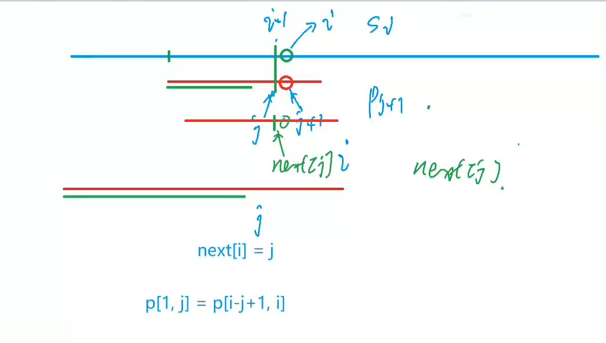
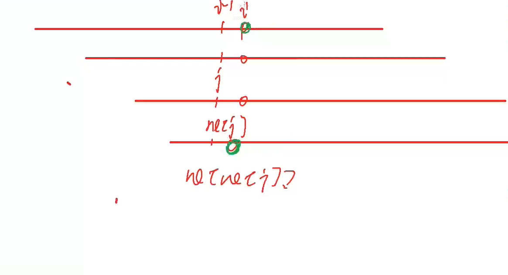

# AcWing 算法基础课 -- 数据结构

## AcWing 831. KMP字符串

`难度：简单`

### 题目描述

给定一个模式串S，以及一个模板串P，所有字符串中只包含大小写英文字母以及阿拉伯数字。

模板串P在模式串S中多次作为子串出现。

求出模板串P在模式串S中所有出现的位置的起始下标。

**输入格式**

第一行输入整数N，表示字符串P的长度。

第二行输入字符串P。

第三行输入整数M，表示字符串S的长度。

第四行输入字符串S。

**输出格式**

共一行，输出所有出现位置的起始下标（下标从0开始计数），整数之间用空格隔开。

**数据范围**

$1≤N≤10^5$

$1≤M≤10^6$


**输入样例：**

```R
3
aba
5
ababa
```

**输出样例：**

```R
0 2
```

### Solution

1. 暴力算法怎么做

```javascript
S[N], p[M];
for(int i = 1; i <= n; i++) {
    boolean flag = true;
    for(int j = 1; j <= m; j++) {
        if(s[i + j - 1] != p[j]) {
            flag = false;
            break;
        }
    }    
}
```

2. KMP 优化

```java
import java.util.*;
import java.io.*;

class Main{
    public static void main(String[] args) throws IOException{
        int N = 100010;
        int M = 1000010;
        int[] ne = new int[N];
        BufferedReader br = new BufferedReader(new InputStreamReader(System.in));
        BufferedWriter bw = new BufferedWriter(new OutputStreamWriter(System.out));
        Integer n = Integer.parseInt(br.readLine());
        String sp = " " + br.readLine();
        Integer m = Integer.parseInt(br.readLine());
        String ss = " " + br.readLine();
        char[] p = sp.toCharArray();
        char[] s = ss.toCharArray();
        
        for(int i = 2, j = 0; i <= n; i++) {
            while(j != 0 && p[i] != p[j + 1]) j = ne[j];
            if(p[i] == p[j + 1]) j++;
            ne[i] = j;
        }
        for(int i = 1, j = 0; i <= m; i++) {
            while(j != 0 && s[i] != p[j + 1]) j = ne[j];
            if(s[i] == p[j + 1]) j++;
            if(j == n) {
                bw.write(i - n + " ");
                j = ne[j];
            }
        }
        bw.close();
        br.close();
    }
}
```

### yxc

1. KMP 匹配过程



2. 求 next 数组



```cpp
#include <iostream>

using namespace std;

const int N = 100010, M = 1000010;

int n, m;
int ne[N];
char s[M], p[N];

int main()
{
    cin >> n >> p + 1 >> m >> s + 1;
	
    // 求 next 数组过程
    for (int i = 2, j = 0; i <= n; i ++ )
    {
        while (j && p[i] != p[j + 1]) j = ne[j];
        if (p[i] == p[j + 1]) j ++ ;
        ne[i] = j;
    }

    // kmp 匹配过程
    for (int i = 1, j = 0; i <= m; i ++ )
    {
        while (j && s[i] != p[j + 1]) j = ne[j];
        if (s[i] == p[j + 1]) j ++ ;
        if (j == n)
        {
            printf("%d ", i - n);
            j = ne[j];
        }
    }

    return 0;
}

// 作者：yxc
// 链接：https://www.acwing.com/activity/content/code/content/43108/
// 来源：AcWing
// 著作权归作者所有。商业转载请联系作者获得授权，非商业转载请注明出处。
```

我们直接开始讲这题。你上传的是 **AcWing 831. KMP 字符串**，它属于 **字符串匹配 / KMP**，在你的学习目录里对应 **第二讲：数据结构** 中的 KMP 内容。

---

## 一、这题属于什么题型，核心考点是什么

这题的题型很明确：

* **模式串匹配**
* 给定 **模式串 P** 和 **文本串 S**
* 找出 **P 在 S 中所有出现的起始下标**

核心考点有两个：

1. **next / ne 数组怎么求**
2. **KMP 匹配时失配后怎么快速跳转**

这题是 KMP 的标准模板题，重点不在“想复杂策略”，而在于：

* 理解 `j` 表示什么
* 理解 `ne[i]` 表示什么
* 理解为什么失配时可以 `j = ne[j]`

---

## 二、先看朴素做法，再看为什么要优化

### 1. 朴素做法

你笔记里已经给了暴力思路：从 `S` 的每个位置出发，尝试和 `P` 一位一位比较。

例如：

* `S = ababa`
* `P = aba`

从 `S[0]` 开始比，匹配成功
从 `S[1]` 开始比，失败
从 `S[2]` 开始比，又成功

所以答案是 `0 2`

### 2. 朴素做法的问题

暴力匹配时，一旦失配，通常要把模式串重新挪到下一个位置，再从头开始比。

最坏情况下复杂度接近：

[
O(N \times M)
]

而本题数据范围是：

* `|P| ≤ 10^5`
* `|S| ≤ 10^6`

暴力会超时。

---

## 三、KMP 的核心思路是什么

一句话概括：

> **失配时，不让模式串回到开头，而是利用已经匹配过的信息，直接跳到“还能继续尝试的位置”。**

KMP 的精华就在于：
**前面已经匹配过的内容，不白匹配。**

---

## 四、`ne` 数组到底表示什么

这是初学者最容易糊涂的地方。

### 定义

`ne[i]` 表示：

> 在模式串 `P` 的前 `i` 个字符中，
> **最长的“前缀”和“后缀”相等** 的长度，
> 并且这个前缀和后缀不能是整个串本身。

这里的“前缀”“后缀”都指 **真前缀 / 真后缀**。

### 举例

假设模式串：

```text
P = a b a b a
    1 2 3 4 5
```

看 `P[1..5] = ababa`

它的前缀有：

* `a`
* `ab`
* `aba`
* `abab`

后缀有：

* `a`
* `ba`
* `aba`
* `baba`

最长相等的是 `aba`，长度为 3。
所以：

```text
ne[5] = 3
```

### 直观理解

`ne[i] = j` 的意思是：

当我们已经匹配到模式串第 `i` 位时，
如果下一步失配了，那么前面这 `j` 个字符其实“还能接上”，
不需要从 0 开始重比。

---

## 五、`j` 在代码里表示什么

无论是求 `ne`，还是做匹配，代码里都会有一个 `j`。

你可以统一理解成：

> **当前已经匹配了多少个字符**

也就是：

* 在求 `ne` 时：`j` 表示当前“最长相等前后缀”的长度
* 在匹配时：`j` 表示模式串 `P` 当前已经和文本串 `S` 匹配上的长度

这个理解一旦稳住，KMP 就不乱了。

---

## 六、先讲 `ne` 数组怎么求

你上传的题解里，核心代码是这段：

```java
for(int i = 2, j = 0; i <= n; i++) {
    while(j != 0 && p[i] != p[j + 1]) j = ne[j];
    if(p[i] == p[j + 1]) j++;
    ne[i] = j;
}
```

我们把它拆开解释。

### 1. 为什么从 `i = 2` 开始

因为：

* `ne[1] = 0` 一定成立
* 只有 1 个字符，不可能有非空的真前后缀相等

所以从第二个字符开始求。

---

### 2. `while (j != 0 && p[i] != p[j + 1])`

这一句表示：

当前想把 `p[i]` 接到已经匹配的前缀后面，
也就是想看它能不能和 `p[j+1]` 对上。

如果对不上，说明当前长度 `j` 不行，
那就缩小到更短的候选前后缀：

```java
j = ne[j];
```

也就是：

> 既然长度为 `j` 的前后缀接不上，那就尝试“次长”的那个。

这就是 KMP 的“跳”。

---

### 3. `if (p[i] == p[j + 1]) j++;`

如果当前字符能接上，就把匹配长度加 1。

---

### 4. `ne[i] = j;`

说明：

* 到位置 `i` 为止
* 最长相等前后缀长度就是 `j`

---

## 七、再讲匹配过程怎么做

题解中的匹配代码是：

```java
for(int i = 1, j = 0; i <= m; i++) {
    while(j != 0 && s[i] != p[j + 1]) j = ne[j];
    if(s[i] == p[j + 1]) j++;
    if(j == n) {
        bw.write(i - n + " ");
        j = ne[j];
    }
}
```

这段和求 `ne` 非常像，只是对象从“模式串内部”变成了“文本串和模式串之间”。

### 含义

* `i`：当前扫描到文本串 `S` 的位置
* `j`：当前已经和模式串 `P` 匹配了多少位

---

### 1. 如果失配

```java
while(j != 0 && s[i] != p[j + 1]) j = ne[j];
```

表示：

* 当前 `S[i]` 想和 `P[j+1]` 匹配
* 如果失败了，不让 `i` 回退
* 只让 `j` 根据 `ne` 回退

这就是 KMP 比暴力快的本质：

> **文本串指针不回退，只移动模式串状态。**

---

### 2. 如果匹配成功

```java
if(s[i] == p[j + 1]) j++;
```

表示模式串又多匹配了一位。

---

### 3. 如果 `j == n`

说明整个模式串都匹配完了，找到一个答案。

起始下标为什么是：

```java
i - n
```

因为这里采用的是 **下标从 1 开始存字符串**：

* 当前匹配结束位置是 `i`
* 模式串长度是 `n`
* 起点就是 `i - n + 1`

但题目要求输出 **0-based 下标**

所以输出的是：

```java
(i - n + 1) - 1 = i - n
```

这个细节很关键。

---

### 4. 为什么匹配成功后还要 `j = ne[j]`

因为题目要求找 **所有出现位置**，包括重叠出现。

例如：

* `P = aba`
* `S = ababa`

当第一次匹配到 `0` 位置后，后面其实还能继续匹配出 `2`。

所以不能把 `j` 直接清零，
而是应该跳到：

```java
j = ne[j];
```

表示保留“还能继续利用的那部分前缀”。

这正是 KMP 能处理重叠匹配的原因。

---

## 八、这题的完整 Java 写法

我给你整理成一个更适合初学者阅读的 Java 版本：

```java
import java.io.*;

public class Main {
    static final int N = 100010;
    static final int M = 1000010;

    public static void main(String[] args) throws Exception {
        BufferedReader br = new BufferedReader(new InputStreamReader(System.in));
        BufferedWriter bw = new BufferedWriter(new OutputStreamWriter(System.out));

        int n = Integer.parseInt(br.readLine());
        char[] p = (" " + br.readLine()).toCharArray(); // 1-based

        int m = Integer.parseInt(br.readLine());
        char[] s = (" " + br.readLine()).toCharArray(); // 1-based

        int[] ne = new int[N];

        // 1. 求模式串的 next(ne) 数组
        for (int i = 2, j = 0; i <= n; i++) {
            // 当前字符接不上，就往前跳
            while (j > 0 && p[i] != p[j + 1]) {
                j = ne[j];
            }

            // 能接上，则匹配长度 +1
            if (p[i] == p[j + 1]) {
                j++;
            }

            ne[i] = j;
        }

        // 2. KMP 匹配
        for (int i = 1, j = 0; i <= m; i++) {
            // 失配则利用 ne 数组回退 j
            while (j > 0 && s[i] != p[j + 1]) {
                j = ne[j];
            }

            // 当前字符匹配成功
            if (s[i] == p[j + 1]) {
                j++;
            }

            // 找到一个完整模式串
            if (j == n) {
                bw.write((i - n) + " "); // 输出 0-based 起点
                j = ne[j]; // 继续寻找下一个（支持重叠）
            }
        }

        bw.flush();
    }
}
```

---

## 九、实现时要特别注意的细节

### 1. 为什么前面加一个空格

```java
char[] p = (" " + str).toCharArray();
```

这是为了让字符串从 `1` 开始存。

这样写之后：

* `p[1]` 就是第一个字符
* `p[j + 1]` 写起来很顺
* 和 C++ 模板完全对应

对初学者来说，这种写法反而更清晰。

---

### 2. `j + 1` 不会越界吗

不会，因为：

* `j` 表示已经匹配的长度
* 下一位自然是 `j + 1`
* 并且只有在合理范围内才会进入比较

---

### 3. `while` 不能写成 `if`

这是非常重要的点。

失配以后，可能要连续跳很多次：

```java
j = ne[j]
j = ne[ne[j]]
...
```

直到：

* `j == 0`
* 或者当前字符能接上

所以必须是 `while`，不能只退一次。

---

### 4. 为什么 `ne` 数组大小开到 `100010`

因为题目给了：

* 模式串最大长度 `10^5`

所以开大一点防止越界。

同理，文本串数组开到 `1000010`。

---

## 十、时间复杂度和空间复杂度

### 时间复杂度

* 求 `ne`：`O(n)`
* 匹配：`O(m)`

总复杂度：

[
O(n + m)
]

### 空间复杂度

* `ne` 数组：`O(n)`
* 字符数组：`O(n + m)`

这是这题的标准最优做法。

---

## 十一、这题为什么最后能想到 KMP

这一部分我放在最后讲，因为这是“题型识别能力”的关键。

当你以后看到一道题，出现下面这些信号时，就应该往 KMP 上想：

### 触发信号 1：字符串匹配

题目在问：

* 一个串是否出现在另一个串里
* 出现了多少次
* 所有出现位置
* 是否允许重叠出现

这就是 KMP 的典型使用场景。

---

### 触发信号 2：数据范围很大

这题里：

* 模式串 `10^5`
* 文本串 `10^6`

暴力 `O(nm)` 明显不行。

只要看到：

* 字符串匹配
* 数据范围大
* 需要线性或接近线性的做法

就要考虑 KMP。

---

### 触发信号 3：失配后前面信息可以复用

KMP 的本质是：

> 失配后，不从头再来，而是利用“前缀 = 后缀”的结构继续匹配。

所以当题目看起来像：

* “前面已经匹配了一大段”
* “这些信息不应该浪费”
* “应该能快速跳到某个位置继续”

就说明 KMP 很可能是正解。

---

## 十二、怎么举一反三

你学完这题后，至少要能迁移到下面几类题：

### 1. 判断模式串是否出现过

只要在匹配过程中发现一次 `j == n` 即可。

### 2. 统计出现次数

每次 `j == n` 时计数加一。

### 3. 输出所有匹配位置

这题就是模板。

### 4. 求字符串的周期 / border

这类题会大量用到 `ne` 数组含义。

### 5. 把 KMP 用在更复杂字符串题里

比如：

* 最短循环节
* 拼接串匹配
* 前缀后缀性质判断

所以这题不是孤立模板，而是后面很多字符串题的起点。

---

## 十三、你现在最该记住的 4 句话

1. `ne[i]`：模式串前 `i` 位中，最长相等真前后缀长度
2. `j`：当前已经匹配了多少位
3. 失配时：`j = ne[j]`
4. 匹配成功后若 `j == n`，说明找到一个完整匹配

---

## 十四、给你一个简短总结

这题是 **KMP 模板题**。
整体流程只有两步：

1. **先求模式串的 `ne` 数组**
2. **再用 `ne` 数组在线性时间内完成匹配**

代码看起来两段很像，原因是它们本质上都在做同一件事：

> 当前字符接不上时，利用已经匹配的信息往前跳。

你可以把 KMP 理解成一句话：

> **让模式串自己告诉我们：失配以后，下一步应该从哪里继续。**

如果你愿意，我下一条可以继续带你做一遍这题的 **手动模拟过程**，把 `ne` 数组和匹配过程一位一位推出来。

# 为什么while(j != 0 && p[i] != p[j + 1]) j = ne[j];这一句写在if前面？ 带我手推一个例子

好，我们就专门把这句掰开讲清楚：

```java
while (j != 0 && p[i] != p[j + 1]) j = ne[j];
if (p[i] == p[j + 1]) j++;
```

你问的是：**为什么 `while` 要写在 `if` 前面？**

---

## 一、先给一句最核心的话

因为在判断“能不能把 `p[i]` 接到当前长度为 `j` 的前后缀后面”之前，
你必须先把 **所有不可能的 `j`** 都退掉。

也就是：

* 当前这个 `j` 也许不行
* 退到 `ne[j]` 后也许还不行
* 还要继续退
* 直到：

    * `j == 0`，或者
    * `p[i] == p[j + 1]`

所以顺序必须是：

1. **先 while，不断回退**
2. **再 if，看看现在能不能接上**

---

## 二、这时候的 `j` 到底表示什么

在求 `ne[i]` 的循环里：

```java
for (int i = 2, j = 0; i <= n; i++)
```

处理到 `i` 时，`j` 表示：

> 当前我们已经知道，`p[1..i-1]` 的最长相等前后缀长度是 `j`

现在我们要做的是：

> 看看 `p[i]` 能不能把这个长度为 `j` 的匹配再延长 1 位

所以要比较：

```java
p[i] 和 p[j + 1]
```

因为：

* 前缀那边已经匹配了 `j` 位
* 下一位自然应该看 `j + 1`

---

## 三、为什么一定要先 `while`

因为当前这个 `j` 不一定能接上。

如果：

```java
p[i] != p[j + 1]
```

说明什么？

说明：

> “长度为 `j` 的这个候选前后缀，不成立了，不能继续延长。”

那怎么办？

就退到更短的候选：

```java
j = ne[j];
```

而且退一次后，**新的 `j` 也可能还是不行**，所以要继续退。

这就是为什么必须用：

```java
while (...)
```

而不是直接一个 `if`。

---

## 四、为什么不能把 `if` 放前面

因为 `if` 的意义是：

> 现在这个 `j` 已经合法了，若 `p[i] == p[j+1]`，那就可以扩展一位

也就是说，`if` 的前提是：

> 你已经通过 `while` 把 `j` 调整到“当前最合适的候选长度”了

如果你把顺序反过来，问题就来了：

* 你先拿一个**还没调整好**的 `j` 去判断
* 如果当前这个 `j` 不行，后面退回去以后，也许会变成“行”
* 但这时你的 `if` 已经错过了

结果就会算错。

---

## 五、带你手推一个特别适合说明这个问题的例子

我们用模式串：

```text
p = a a b a a a b
    1 2 3 4 5 6 7
```

我们来手推 `ne` 数组。

---

## 六、一步一步推 `ne`

---

### `i = 1`

只有一个字符：

```text
ne[1] = 0
```

---

### `i = 2`，求 `ne[2]`

当前串是：

```text
aa
```

初始 `j = 0`

比较：

```text
p[2] 和 p[1]
a    和 a
```

相等，所以：

```java
j++;
```

得到：

```text
j = 1
ne[2] = 1
```

---

### `i = 3`，求 `ne[3]`

当前串是：

```text
aab
```

此时 `j = 1`，表示：

> 对于 `p[1..2] = aa`，最长相等前后缀长度是 1

现在想看 `p[3]` 能不能接在后面。

比较：

```text
p[3] 和 p[j+1] = p[2]
b    和 a
```

不相等，所以当前 `j = 1` 不行，进入 `while`：

```java
j = ne[j] = ne[1] = 0
```

现在 `j = 0`，退出 `while`

再做 `if`：

比较：

```text
p[3] 和 p[1]
b    和 a
```

还是不等，所以不加。

最后：

```text
ne[3] = 0
```

---

### `i = 4`，求 `ne[4]`

当前串：

```text
aaba
```

此时 `j = 0`

比较：

```text
p[4] 和 p[1]
a    和 a
```

相等，所以：

```text
j = 1
ne[4] = 1
```

---

### `i = 5`，求 `ne[5]`

当前串：

```text
aabaa
```

此时 `j = 1`

比较：

```text
p[5] 和 p[2]
a    和 a
```

相等，所以：

```text
j = 2
ne[5] = 2
```

---

## 七、重点来了：`i = 6`

当前串：

```text
aabaaa
```

此时 `j = 2`

这表示：

> 对 `p[1..5] = aabaa`，最长相等前后缀长度是 2

也就是前后缀都是：

```text
aa
```

现在我们想看 `p[6] = a` 能不能把这个长度 2 再延长。

### 第一次比较

看：

```text
p[6] 和 p[j+1] = p[3]
a    和 b
```

不相等。

这说明：

> 长度为 2 的这个候选前后缀，不能继续扩展。

所以必须先退：

```java
j = ne[j] = ne[2] = 1
```

---

### 退完后再比较

现在 `j = 1`

再看：

```text
p[6] 和 p[j+1] = p[2]
a    和 a
```

相等了！

于是执行 `if`：

```java
j++;
```

得到：

```text
j = 2
ne[6] = 2
```

---

## 八、这个地方正好说明：为什么 `while` 必须在 `if` 前

我们把刚才 `i = 6` 的过程单独拿出来看：

初始：

```text
j = 2
p[6] = a
要比的是 p[3] = b
```

发现不等，所以当前 `j = 2` 不合法。

必须先退到：

```text
j = ne[2] = 1
```

然后再比较：

```text
p[6] 和 p[2]
a    和 a
```

这时才合法，才能 `j++`

---

## 九、如果把顺序写反，会发生什么

假设你错误地写成：

```java
if (p[i] == p[j + 1]) j++;
while (j != 0 && p[i] != p[j + 1]) j = ne[j];
```

还是看刚才 `i = 6`：

初始：

```text
j = 2
p[6] = a
p[3] = b
```

先执行 `if`：

```text
a == b ? 不是
```

所以 `j` 不变。

然后执行 `while`：

```text
j = ne[2] = 1
```

现在其实已经可以匹配了，因为：

```text
p[6] == p[2]
a == a
```

但很可惜，**你的 `if` 已经执行完了**，不会再补一次 `j++`。

于是最后得到：

```text
ne[6] = 1
```

这是错的。

正确答案应该是：

```text
ne[6] = 2
```

所以这就是最直接的原因：

> **有些位置一开始不能匹配，但回退以后就能匹配。**
>
> 所以必须先 `while` 回退，再 `if` 判断是否扩展。

---

## 十、把整个 `ne` 数组推完

我们继续：

### `i = 7`

此时 `j = 2`

比较：

```text
p[7] 和 p[3]
b    和 b
```

相等，所以：

```text
j = 3
ne[7] = 3
```

---

### 最终 `ne` 数组

对于：

```text
a a b a a a b
1 2 3 4 5 6 7
```

得到：

```text
ne: 0 1 0 1 2 2 3
```

---

## 十一、你可以把这两句理解成固定套路

```java
while (j != 0 && p[i] != p[j + 1]) j = ne[j];
if (p[i] == p[j + 1]) j++;
```

含义就是：

### 第一句 `while`

> 当前候选长度 `j` 不行，那就不断缩短，直到找到一个可能行的。

### 第二句 `if`

> 现在 `j` 已经调整好了，如果能接上，就把长度加 1。

---

## 十二、再给你一个非常简洁的记忆方式

你可以记成：

> **先退，再接。**

* `while`：先退到合适的位置
* `if`：再看能不能接上当前字符

这就是 KMP 求 `ne` 的核心节奏。

---

## 十三、顺便说一下：匹配阶段也是同样逻辑

在 KMP 匹配文本串时，也会写成：

```java
while (j != 0 && s[i] != p[j + 1]) j = ne[j];
if (s[i] == p[j + 1]) j++;
```

原因完全一样：

* 先把不合法的 `j` 退掉
* 再判断当前字符能不能接上

所以你现在理解了求 `ne` 这段，后面匹配那段也就通了。

---

## 十四、最后帮你总结一句

为什么 `while` 写在 `if` 前？

因为：

> 当前的 `j` 可能不对，要先不断回退到“真正还能尝试匹配”的那个 `j`，
> 然后才能判断当前字符是否可以接上。
> 否则会漏掉“回退以后本来可以匹配”的情况。

---

下一步我可以继续带你手推 **KMP 真正匹配字符串的过程**，比如用：

* 模式串 `aba`
* 文本串 `ababa`

把 `j = ne[j]` 在匹配中的作用也一位一位推出来。

# 为什么可以移动模式串，利用已经匹配过的字符？这里如何利用相等前后缀的？我不明白为什么回退j 就可以继续匹配

这个问题问得非常好。你真正卡住的地方其实是：

> **为什么失配以后，不需要让文本串回头？**
>
> **为什么只把 `j` 回退到 `ne[j]`，就还能继续匹配？**

这正是 KMP 最核心的地方。
我这次不直接讲代码，先用“位置关系”把它讲透。

---

## 一、先明确一句话：`j` 回退，不是随便回退

当我们写：

```java
j = ne[j];
```

不是说“拍脑袋退一点”。

而是说：

> 已经匹配好的这 `j` 个字符里，
> 我们知道它的 **前缀** 和 **后缀** 有一段是相等的，长度是 `ne[j]`。
> 所以这段内容可以直接保留下来，继续尝试匹配。

也就是说，KMP 不是“跳过比较”，而是：

> **把前面已经比较过、并且逻辑上一定相等的那一段，直接复用。**

---

## 二、先看“已经匹配了 j 个字符”是什么意思

假设文本串是 `S`，模式串是 `P`。

在匹配过程中，某一时刻 `j = 5`，表示：

> 模式串前 5 个字符 `P[1..5]`
> 已经和文本串当前某一段完全相等了。

也就是：

```text
P[1..5] == S[某一段长度为5的后缀]
```

更具体一点，假设当前扫到文本串位置 `i`，并且已经匹配了 `j` 个字符，表示：

```text
S[i-j+1 .. i] == P[1 .. j]
```

这个等式很重要。

意思是：

* 文本串里以 `i` 结尾的这一段
* 和模式串前 `j` 位
* 已经一模一样

---

## 三、现在失配了，发生了什么

接下来本来想比较：

```text
S[i+1] 和 P[j+1]
```

但发现不相等，失配了。

这时候暴力做法会想：

* 那我把模式串往后挪一格
* 重新从头匹配

但 KMP 会问一个更聪明的问题：

> 在刚才已经匹配成功的那 `j` 个字符里，
> 有没有一部分，其实仍然可能成为“新的开头”？

答案就是：看 `ne[j]`。

---

## 四、为什么看 `ne[j]`

`ne[j]` 表示：

> 在 `P[1..j]` 里，
> 最长的相等真前缀 = 真后缀 的长度

设这个长度是 `k = ne[j]``

那就说明：

```text
P[1..k] == P[j-k+1 .. j]
```

也就是说：

* 模式串前 `k` 个字符
* 等于模式串最后 `k` 个字符

---

## 五、这和文本串有什么关系

刚才我们已经知道：

```text
S[i-j+1 .. i] == P[1 .. j]
```

这表示文本串这一大段等于模式串前 `j` 位。

而模式串前 `j` 位的最后 `k` 位，也就是：

```text
P[j-k+1 .. j]
```

因为它等于前缀 `P[1..k]`，所以：

```text
P[1..k] == P[j-k+1 .. j]
```

再结合：

```text
S[i-j+1 .. i] == P[1 .. j]
```

就能推出：

> 文本串当前这段的最后 `k` 个字符，
> 一定等于模式串的前 `k` 个字符。

也就是：

```text
S[i-k+1 .. i] == P[1 .. k]
```

这句话就是 KMP 的本质。

---

## 六、这句话到底说明了什么

说明：

虽然原来长度为 `j` 的匹配失效了，
但是长度为 `k = ne[j]` 的匹配 **仍然成立**。

所以我们可以直接把状态改成：

```java
j = ne[j];
```

意思就是：

> 我不再认为已经匹配了 `j` 个字符，
> 但我仍然可以确认：已经匹配了 `k` 个字符。

于是接下来就可以继续拿当前字符去比较：

```text
S[i+1] 和 P[k+1]
```

这就是“只回退 `j`，不回退文本串”。

因为文本串最后那一段已经被证明和 `P[1..k]` 相等了，
没必要再重新检查一遍。

---

## 七、我们手画一个具体例子

用最经典的例子来说明。

### 模式串

```text
P = a b a b a c
    1 2 3 4 5 6
```

先看前 5 位：

```text
P[1..5] = ababa
```

它的最长相等前后缀是：

```text
aba
```

所以：

```text
ne[5] = 3
```

因为：

```text
前缀: P[1..3] = aba
后缀: P[3..5] = aba
```

---

### 假设当前匹配到了这里

文本串中某一段已经和 `P[1..5]` 匹配成功：

```text
... a b a b a
    | | | | |
    a b a b a
```

也就是现在 `j = 5`。

接下来比较第 6 位：

```text
文本当前字符 = x
模式串 P[6] = c
```

如果 `x != c`，就失配了。

---

## 八、失配后为什么可以直接退到 `j = 3`

因为前面已经匹配好的内容是：

```text
ababa
```

这个串的后 3 位是：

```text
aba
```

而模式串的前 3 位也是：

```text
aba
```

所以虽然长度 5 的匹配不能继续了，但我们仍然知道：

```text
当前文本末尾这 3 个字符 = aba = P[1..3]
```

所以可以直接把模式串看成“前 3 位还匹配着”，也就是：

```text
j = 3
```

然后继续尝试比较：

```text
当前失配字符 x 和 P[4]
```

这就是“回退 j 就可以继续匹配”。

---

## 九、你真正要理解的是：不是模式串真的来回移动，而是“匹配状态”在变

你看到“移动模式串”，容易想成物理上真的把模式串拖来拖去。

其实代码里根本没移动字符串。

所谓：

> **文本串指针不回退，只移动模式串状态**

更准确地说是：

> 文本串位置 `i` 不回退，
> 但“模式串当前已经匹配到哪里”这个状态 `j` 会回退。

因为：

* `i` 表示我们读到文本串哪里了
* `j` 表示模式串前多少位已经匹配成功

失配时：

* 文本串当前字符还在这里
* 我们只是换一个“更短但仍然成立的匹配长度”去接它

---

## 十、为什么不用重新检查文本串那几位

因为那几位已经被逻辑证明相等了。

这是关键。

比如你已经知道：

```text
文本末尾 = aba
模式串前缀 = aba
```

那这 3 个字符还要不要重新一个个比较？

不用。

因为它们不是“猜测相等”，而是由：

1. 已经匹配成功的 `j` 位
2. `ne[j]` 的前后缀相等性质

共同推出的必然结论。

所以 KMP 快就快在：

> **把“必然相等”的比较省掉了。**

---

## 十一、再换一种更生活化的理解

你可以这样想：

已经匹配了：

```text
P[1..j]
```

现在最后一个字符接不上。

但 `P[1..j]` 自己内部有个结构：

* 前面一段 = 后面一段

那么既然刚才文本串已经等于 `P[1..j]`，
它的结尾那一段当然也等于这个“前面一段”。

所以模式串没必要从头开始，
可以直接把这段“前面一段”接上，继续往后试。

---

## 十二、最小例子再看一次

模式串：

```text
P = a b a b a
```

假设已经匹配了 5 位：

```text
ababa
```

而：

```text
ne[5] = 3
```

因为：

```text
前缀 aba = 后缀 aba
```

现在下一位失配了。

那我们就知道：

* 原来匹配的文本后缀是 `aba`
* 它正好等于模式串前缀 `aba`

所以新的匹配长度直接变成 3：

```text
j = 3
```

然后继续比较下一位。

---

## 十三、为什么这不会漏答案，也不会错位

因为 `ne[j]` 选的是：

> 当前已经匹配的这段里，仍然可能作为新开头的最长长度

它不是随便找一段，而是“最长还能保留的合法长度”。

所以：

* 不会漏掉可能的匹配
* 还能尽量保留最多已知信息
* 这就是最优跳法

如果这个长度还不行，就继续：

```java
j = ne[j];
```

继续退到更短的合法前后缀。

---

## 十四、最后压成一句你最好记住的话

为什么回退 `j` 就能继续匹配？

因为：

> 当长度 `j` 的匹配失效时，
> `P[1..j]` 的最长相等前后缀长度 `ne[j]` 告诉我们：
> 文本串末尾已经有一段长度为 `ne[j]` 的内容，必然等于模式串前缀。
> 所以这段匹配可以直接继承下来，不用重比。

---

## 十五、给你一个超短版记忆

你可以只记这句：

> **失配后，`j = ne[j]` 的本质不是“重来”，而是“保留还能成立的那一段匹配”。**

---

如果你愿意，我下一条直接给你画一个 **“文本串和模式串错位对齐图”**，把“为什么模式串相当于往右滑到那个位置”完整画出来，你会一下子彻底通。

```java
import java.io.*;

class Main {
  public static void main(String[] args) throws IOException {
    BufferedReader bufferedReader = new BufferedReader(new InputStreamReader(System.in));
    BufferedWriter bufferedWriter = new BufferedWriter(new OutputStreamWriter(System.out));
    int n = Integer.parseInt(bufferedReader.readLine());
    // 为了让第一个有效字符放在数组下标 1 位置，在转换前加一个空格
    char[] part = (" " + bufferedReader.readLine()).toCharArray();

    int m = Integer.parseInt(bufferedReader.readLine());
    char[] text = (" " + bufferedReader.readLine()).toCharArray();

    int[] next = new int[n + 10];

        /*
         计算 next 数组
         next[i] 表示模式串前 i 个字符的最长相等真前后缀长度
         */
    for (int j = 0, i = 2; i <= n; i++) {
      // j != 0 说明当前还能继续回退
      while (j != 0 && part[j + 1] != part[i]) j = next[j];

      // 当前字符可以接在长度为 j 的公共前后缀后面
      if (part[j + 1] == part[i]) j++;

      next[i] = j;
    }

    // KMP 匹配
    for (int j = 0, i = 1; i <= m; i++) {
      while (j != 0 && part[j + 1] != text[i]) j = next[j];

      if (part[j + 1] == text[i]) j++;

      if (j == n) {
        bufferedWriter.write(i - j + " ");
        // 继续寻找下一个匹配位置（支持重叠）
        j = next[j];
      }
    }
    bufferedWriter.close();
    bufferedReader.close();
  }
}
```