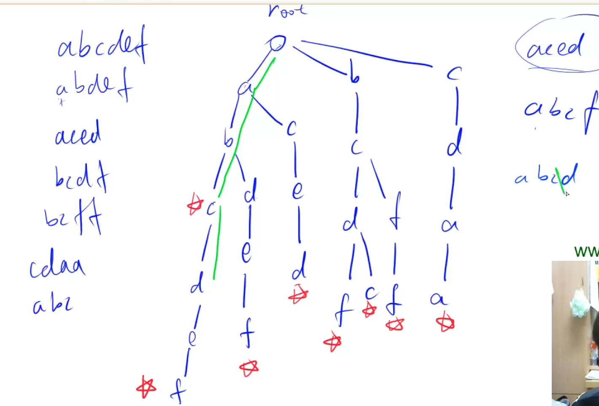

# AcWing 算法基础课 -- 数据结构

## AcWing 835. Trie字符串统计 

`难度：简单`

### 题目描述

维护一个字符串集合，支持两种操作：

1. “I x”向集合中插入一个字符串x；
2. “Q x”询问一个字符串在集合中出现了多少次。

共有N个操作，输入的字符串总长度不超过 $10^5$，字符串仅包含小写英文字母。

**输入格式**

第一行包含整数N，表示操作数。

接下来N行，每行包含一个操作指令，指令为”I x”或”Q x”中的一种。

**输出格式**

对于每个询问指令”Q x”，都要输出一个整数作为结果，表示x在集合中出现的次数。

每个结果占一行。

**数据范围**

$1 ≤ N ≤ 2 ∗ 10^4$

```r
输入样例：

5
I abc
Q abc
Q ab
I ab
Q ab

输出样例：

1
0
1

```

### Solution

1. 偷懒做法，用一个哈希表存储，做到时间复杂度为 O(n)。

```java
import java.util.*;
import java.io.*;

public class Main{
    public static void main(String[] args) throws IOException{
        BufferedReader br = new BufferedReader(new InputStreamReader(System.in));
        BufferedWriter bw = new BufferedWriter(new OutputStreamWriter(System.out));
        int n = Integer.parseInt(br.readLine());
        Map<String, Integer> map = new HashMap<>();
        String[] s;
        while(n > 0){
            n--;
            s = br.readLine().split(" ");
            if(s[0].equals("I")){
                map.put(s[1], map.getOrDefault(s[1], 0) + 1);
            }else{
                bw.write(map.getOrDefault(s[1], 0) + "\n");
            }
        }
        bw.close();
        br.close();
    }
}
```

2. 构造 Trie 树，Trie 树是**高效存储和查找字符串集合的数据结构**。

```java
import java.util.*;
import java.io.*;

public class Main{
    public static int N = 100010;
    // 记录当前是第几个结点
    public static int idx = 0;
    // 记录以当前结点为结尾的个数
    public static int[] cnt = new int[N];
    // 二维矩阵, N 为总字符串长度, 26 为每个结点最大可能有 26 个分支
    public static int[][] trie = new int[N][26];
    public static void main(String[] args) throws IOException{
        BufferedReader br = new BufferedReader(new InputStreamReader(System.in));
        BufferedWriter bw = new BufferedWriter(new OutputStreamWriter(System.out));
        int n = Integer.parseInt(br.readLine());
        String[] s;
        while(n-- > 0){
            s = br.readLine().split(" ");
            if(s[0].equals("I")){
                insert(s[1]);
            }else{
                int res = query(s[1]);
                bw.write(res + "\n");
            }
        }
        bw.close();
        br.close();
    }
    public static void insert(String s){
        // 每个字符串都从字典树的 0 级也就是 跟开始找
        int  p = 0;
        for(int i =0; i < s.length(); i++){
            int t = s.charAt(i) - 'a';
            // 如果这个 字母不存在,就新建一个结点,并且指向它
            if(trie[p][t] == 0) {
                // idx ++
                idx ++;
                trie[p][t] = idx;
            }
            // 更新结点序号
            p = trie[p][t];
        }
        // 更新以 idx 为结尾的字符串的个数
        cnt[p] ++;
    }
    public static int query(String s){
        int p = 0;
        for(int i = 0; i < s.length(); i++){
            int t = s.charAt(i) - 'a';
            if(trie[p][t] == 0) return 0;
            p = trie[p][t];
        }
        return cnt[p];
    }
}
```

### yxc



我们直接开始讲这题。

这题是 **Trie（字典树）入门题**，题目文件我已经看过了：

---

## 一、这题属于什么题型

这是一个很典型的 **字符串集合维护 + 查询出现次数** 的题。

支持两种操作：

* `I x`：插入字符串 `x`
* `Q x`：查询字符串 `x` 出现了多少次

核心考点是：

* **Trie 树的基本结构**
* **字符串插入**
* **字符串查询**
* **结尾标记 / 计数数组 `cnt[]` 的含义**

虽然你给的题解里也写了 `HashMap<String,Integer>` 的做法，但这题在 AcWing 的目的主要是让你掌握 **Trie 树怎么写**。`HashMap` 属于“能做出来”，Trie 属于“这类题标准做法”。

---

## 二、先说最直接的理解

题目本质上是在维护一个字符串多重集合。

例如依次插入：

* `abc`
* `ab`
* `abc`

那么集合里：

* `abc` 出现 2 次
* `ab` 出现 1 次

查询时就返回这个次数。

---

## 三、朴素做法和优化做法对比

### 1. 朴素做法：HashMap

你题解里第一种写法：

```java
Map<String, Integer> map = new HashMap<>();
```

插入：

```java
map.put(s, map.getOrDefault(s, 0) + 1);
```

查询：

```java
map.getOrDefault(s, 0)
```

这个做法完全正确，而且这题数据范围下也能过。因为 Java 的 `HashMap` 查找和插入平均复杂度接近 `O(1)`。

### 2. 这题真正想练的做法：Trie

Trie 的优势不是这题必须用，而是它适合处理一整类问题：

* 判断字符串是否存在
* 统计某字符串出现次数
* 统计某前缀出现次数
* 求字典序相关问题
* 多模式字符串存储

所以这题重点不是“为了过题必须 Trie”，而是“借这题学 Trie 的基本模板”。

---

## 四、Trie 到底是什么

Trie 可以理解成一棵“按字符一层一层往下走”的树。

例如插入：

* `ab`
* `abc`
* `b`

大概结构是：

* 根节点

    * `a`

        * `b`

            * `c`
    * `b`

每条从根到某个节点的路径，表示一个字符串前缀。

**关键点：**
Trie 不是把整个字符串存在一个节点里，而是 **一个节点表示一个前缀位置**。

---

## 五、这题的核心做法

你题解里的 Trie 版本用的是 **静态数组模拟 Trie**，这是竞赛里最常见、最好写的版本。

### 1. 主要数组含义

```java
public static int[][] trie = new int[N][26];
public static int[] cnt = new int[N];
public static int idx = 0;
```

分别表示：

#### `trie[p][u]`

表示“从编号为 `p` 的节点出发，沿着字母 `u` 这条边，走到哪个节点”。

这里：

* `p`：当前节点编号
* `u`：字符编号，`0~25`
* `trie[p][u] = q`：说明 `p` 节点有一条字符为 `u` 的边，指向节点 `q`

#### `cnt[p]`

表示：**有多少个字符串恰好在节点 `p` 结束**

注意是“恰好结束”，不是“经过这里”。

#### `idx`

表示当前已经用了多少个节点。

* 根节点固定为 `0`
* 新建节点时：`++idx`

---

## 六、插入操作怎么做

### 1. 整体思路

插入字符串时，从根节点 `0` 开始，依次处理每个字符：

* 看当前节点有没有这个字符对应的儿子
* 没有就新建一个
* 然后走到那个儿子节点
* 字符串走完后，在最后那个节点上 `cnt[p]++`

### 2. 对照代码理解

```java
public static void insert(String s){
    int p = 0;
    for(int i = 0; i < s.length(); i++){
        int t = s.charAt(i) - 'a';
        if(trie[p][t] == 0) {
            idx ++;
            trie[p][t] = idx;
        }
        p = trie[p][t];
    }
    cnt[p] ++;
}
```

### 3. 举例演示

插入 `"abc"`：

#### 开始

* `p = 0`，表示从根开始

#### 处理 `'a'`

* `t = 'a' - 'a' = 0`
* 如果 `trie[0][0] == 0`，说明以前没有这条路，新建节点
* 假设新节点是 `1`
* 然后 `p = 1`

#### 处理 `'b'`

* `t = 1`
* 如果 `trie[1][1] == 0`，新建节点 `2`
* 然后 `p = 2`

#### 处理 `'c'`

* `t = 2`
* 如果 `trie[2][2] == 0`，新建节点 `3`
* 然后 `p = 3`

#### 插入结束

* `cnt[3]++`

意思是：字符串 `"abc"` 在节点 `3` 结尾，出现次数 +1。

---

## 七、查询操作怎么做

### 1. 整体思路

查询字符串 `s` 时，也从根开始一层层走：

* 如果某个字符对应的边不存在，说明这个字符串根本没插入过，返回 `0`
* 如果一路走完了，就返回最后那个节点的 `cnt[p]`

### 2. 对照代码理解

```java
public static int query(String s){
    int p = 0;
    for(int i = 0; i < s.length(); i++){
        int t = s.charAt(i) - 'a';
        if(trie[p][t] == 0) return 0;
        p = trie[p][t];
    }
    return cnt[p];
}
```

### 3. 为什么返回 `cnt[p]` 而不是 `1`

因为题目问的是 **出现多少次**，而不是“是否存在”。

比如你插入两次 `"abc"`：

* 第一次插入后，`cnt[p] = 1`
* 第二次插入后，`cnt[p] = 2`

此时查询 `"abc"` 就要返回 `2`。

---

## 八、为什么 `Q ab` 可能是 0

这是初学 Trie 时最容易混淆的地方。

比如只插入了 `"abc"`，没有插入 `"ab"`。

那么 Trie 中确实有路径：

* 根 -> `a` -> `b`

但这只能说明 `"ab"` 是某个已插入字符串的前缀，**不能说明 `"ab"` 本身被插入过**。

所以查询 `"ab"` 时，要看走到 `"ab"` 对应节点后，`cnt[p]` 是不是大于 0。

* 如果 `cnt[p] == 0`，说明只是前缀，不是完整字符串
* 如果 `cnt[p] > 0`，说明 `"ab"` 被插入过

这也是为什么 Trie 一定要有“结尾计数”或“结尾标记”。

---

## 九、样例怎么走

题目样例：

```text
5
I abc
Q abc
Q ab
I ab
Q ab
```

### 操作 1：`I abc`

插入 `"abc"`

* `abc` 对应终点节点的 `cnt = 1`

### 操作 2：`Q abc`

查询 `"abc"`

* 路存在
* 终点 `cnt = 1`
* 输出 `1`

### 操作 3：`Q ab`

查询 `"ab"`

* 路存在，因为 `"abc"` 经过了 `ab`
* 但 `"ab"` 没作为完整字符串插入过
* 所以 `cnt = 0`
* 输出 `0`

### 操作 4：`I ab`

插入 `"ab"`

* 这次走已有路径，不需要新建节点
* 直接把 `"ab"` 对应节点的 `cnt++`

### 操作 5：`Q ab`

查询 `"ab"`

* 此时 `cnt = 1`
* 输出 `1`

---

## 十、代码实现细节

你这份代码总体是对的，我帮你把关键细节拆开说一下。

---

### 1. 为什么 `N = 100010`

题目说：

> 输入的字符串总长度不超过 `10^5`

Trie 的节点总数最多就是所有插入字符串的字符总数 + 1 个根节点。

所以开到 `100010` 是够用的。

---

### 2. 为什么根节点是 `0`

静态数组 Trie 一般默认：

* `0` 号节点是根
* 新节点从 `1` 开始编号

所以：

```java
int p = 0;
```

表示每个字符串都从根出发。

---

### 3. 为什么 `trie[p][t] == 0` 表示不存在

因为节点编号从 `1` 开始分配。

所以：

* `0` 既可以表示根节点编号
* 也可以约定为“当前没有这条边”

在这里 `trie[p][t]` 存的是“儿子节点编号”，儿子不可能是根，所以用 `0` 表示空很自然。

---

### 4. 为什么可以用二维数组

```java
int[][] trie = new int[N][26];
```

因为题目明确说了：字符串只包含 **小写英文字母**。

所以每个节点最多只有 26 条边，对应 `'a' ~ 'z'`。

这就是 Trie 里很典型的“定长儿子数组”。

---

### 5. `cnt[p]++` 一定要放在循环后面

这是因为只有整个字符串都处理完后，当前节点 `p` 才表示“这个完整字符串的结尾”。

如果你在中间就加，含义就错了。

---

## 十一、把代码整理成更规范的 Java 版本

下面我给你一个更适合学习和记忆的版本，逻辑和你题解一样，但注释更明确一些：

```java
import java.io.*;

public class Main {
    static final int N = 100010;

    // son[p][u]：节点 p 通过字母 u 指向的儿子节点编号
    static int[][] son = new int[N][26];

    // cnt[p]：以节点 p 结尾的字符串出现次数
    static int[] cnt = new int[N];

    // 当前已经创建到的节点编号，0 号节点是根节点
    static int idx = 0;

    public static void main(String[] args) throws Exception {
        BufferedReader br = new BufferedReader(new InputStreamReader(System.in));
        BufferedWriter bw = new BufferedWriter(new OutputStreamWriter(System.out));

        int n = Integer.parseInt(br.readLine());

        while (n-- > 0) {
            String[] strs = br.readLine().split(" ");
            String op = strs[0];
            String s = strs[1];

            if ("I".equals(op)) {
                insert(s);
            } else {
                bw.write(query(s) + "\n");
            }
        }

        bw.flush();
        bw.close();
        br.close();
    }

    // 插入一个字符串
    static void insert(String s) {
        int p = 0; // 从根节点开始

        for (int i = 0; i < s.length(); i++) {
            int u = s.charAt(i) - 'a';

            // 如果当前边不存在，就创建新节点
            if (son[p][u] == 0) {
                son[p][u] = ++idx;
            }

            // 走到下一个节点
            p = son[p][u];
        }

        // 字符串结束，终点计数加一
        cnt[p]++;
    }

    // 查询某个字符串出现了多少次
    static int query(String s) {
        int p = 0; // 从根节点开始

        for (int i = 0; i < s.length(); i++) {
            int u = s.charAt(i) - 'a';

            // 路不存在，说明字符串没出现过
            if (son[p][u] == 0) {
                return 0;
            }

            p = son[p][u];
        }

        // 返回该字符串结尾节点的计数
        return cnt[p];
    }
}
```

---

## 十二、这题容易错的地方

### 1. 把“经过次数”当成“结尾次数”

这题要统计的是完整字符串出现次数，所以必须在末尾节点记录。

不是路径经过多少次。

---

### 2. 查询到路径存在就返回 1

这是错的。

因为：

* 可能只是前缀，不是完整串
* 可能插入了多次，不是只出现 1 次

所以必须返回 `cnt[p]`。

---

### 3. 节点空间开小了

Trie 节点数不是字符串个数，而是 **总字符数级别**。

---

### 4. `idx` 和 `p` 的含义混淆

* `idx`：全局“新节点编号分配器”
* `p`：当前走到的节点编号

这两个变量初学时很容易搞混。

---

## 十三、时间复杂度和空间复杂度

设所有操作中涉及字符串总长度为 `L`。

### 时间复杂度

* 插入一个字符串：`O(len)`
* 查询一个字符串：`O(len)`

总复杂度就是：

* **`O(L)`**

### 空间复杂度

Trie 需要存所有节点：

* **`O(L * 字符集大小)`**

这里字符集大小固定是 26，所以常写成 **`O(L)`**。

---

## 十四、为什么最后能想到这种解法

这个问题放最后讲最合适，因为这是“题型识别能力”。

当你看到下面这些特征时，就要联想到 Trie：

### 1. 题目对象是很多字符串

不是单个字符串匹配，而是维护一个“字符串集合”。

### 2. 操作反复出现

比如反复：

* 插入字符串
* 查询字符串是否存在
* 查询出现次数
* 查询前缀信息

这类“多次操作字符串集合”的题，很适合 Trie。

### 3. 字符集较小且固定

本题只有 `'a' ~ 'z'`，非常适合开 `26` 个分支。

### 4. 需要利用公共前缀

很多字符串前缀相同，比如：

* `ab`
* `abc`
* `abcd`

Trie 可以把公共前缀合并存储，这是它的本质优势。

---

## 十五、方法迁移：以后遇到哪些题也能往 Trie 想

学完这题后，你可以把 Trie 迁移到这些问题：

### 1. 判断某字符串是否出现过

把 `cnt[p] > 0` 当存在即可。

### 2. 统计某前缀出现多少次

在每个节点再维护一个“经过次数”数组。

### 3. 查询与某字符串相关的信息

比如最大异或对那类题，也会用“01-Trie”。

### 4. 自动补全 / 前缀搜索

本质也是 Trie 的前缀树结构。

---

## 十六、这题你现阶段应该记住什么

不用一下子记很多，先记这 4 句就够了：

1. **Trie 是按字符一层层存字符串的树。**
2. **`trie[p][u]` 表示从节点 `p` 沿字符 `u` 走到哪个儿子。**
3. **插入时走路径，没有就建点。**
4. **查询时走路径，最后看 `cnt[p]`。**

---

## 十七、对你这份题解的评价

你这份题解整体是对的，而且已经抓住了核心：

* `HashMap` 做法正确
* Trie 模板也正确
* `cnt[p]` 的用法也正确

不过从“学习”角度，最需要真正吃透的是这两个点：

* **为什么路径存在不代表字符串存在**
* **为什么要在末尾节点记录 `cnt`**

这两个点一旦理解，Trie 的基础就差不多通了。

---

你这题学完后，最适合紧接着练的是：**Trie 模板题 + 前缀统计题**。

# 完全没看懂插入操作
那我们只讲 **插入操作**，别一下子看整棵 Trie。

你现在可以先把 Trie 当成一件很简单的事：

> **往一棵树里，一层一层地“走字符”。没有路就新建路。**

比如插入字符串 `"abc"`，其实就是做这三步：

* 先走 `'a'`
* 再走 `'b'`
* 再走 `'c'`

走完以后，在最后做个标记：**“这里有一个字符串结束了。”**

---

## 先只看这段代码

```java
public static void insert(String s){
    int p = 0;
    for(int i = 0; i < s.length(); i++){
        int t = s.charAt(i) - 'a';
        if(trie[p][t] == 0) {
            idx ++;
            trie[p][t] = idx;
        }
        p = trie[p][t];
    }
    cnt[p] ++;
}
```

你先不要怕，我们一行一行翻译成人话。

---

## 一、这几个变量到底是什么

### `p`

表示：**我当前走到了哪个节点**

一开始：

```java
int p = 0;
```

意思就是：从根节点出发。

你可以把 `p` 理解成“我现在站在哪里”。

---

### `t`

表示：**当前字符是第几个字母**

```java
int t = s.charAt(i) - 'a';
```

比如：

* `'a' - 'a' = 0`
* `'b' - 'a' = 1`
* `'c' - 'a' = 2`

所以：

* `a` 对应 0
* `b` 对应 1
* `c` 对应 2

这样就能拿字符当下标用了。

---

### `trie[p][t]`

表示：

> **从节点 p 出发，沿着字符 t 这条路，能走到哪个节点**

比如：

* `trie[0][0] = 1`

意思就是：

* 从根节点 `0`
* 走字符 `'a'`
* 到达节点 `1`

你可以把它想成：

> “当前这个点，是否已经有一条字符为 `'a'` 的路？”

---

### `idx`

表示：**新节点编号发到哪里了**

每新建一个节点，就：

```java
idx++;
```

比如原来只有根节点 `0`，那么第一个新节点就是 `1`，再下一个是 `2`。

---

### `cnt[p]`

表示：

> **有多少个字符串，恰好在节点 p 结束**

这句先记住就行，插入时最后才用到。

---

## 二、插入操作到底在干什么

插入一个字符串，比如 `"abc"`，过程就是：

### 第 1 步：从根开始

```java
int p = 0;
```

表示我现在站在根节点。

---

### 第 2 步：看第一个字符 `'a'`

```java
int t = s.charAt(i) - 'a';
```

如果现在 `i = 0`，那么字符就是 `'a'`，所以：

```java
t = 0
```

然后看：

```java
if(trie[p][t] == 0)
```

也就是看：

```java
if(trie[0][0] == 0)
```

意思是：

> 从根节点出发，有没有 `'a'` 这条路？

如果没有，就新建：

```java
idx ++;
trie[p][t] = idx;
```

比如新建了节点 `1`，那就相当于：

```java
trie[0][0] = 1
```

意思变成：

* 从 0 号点
* 走 `'a'`
* 到 1 号点

然后：

```java
p = trie[p][t];
```

就是：

```java
p = trie[0][0];
```

也就是：

```java
p = 1;
```

表示：我现在已经走到 `'a'` 对应的节点了。

---

### 第 3 步：看第二个字符 `'b'`

此时 `p = 1`。

字符 `'b'` 对应：

```java
t = 1
```

再看：

```java
if(trie[1][1] == 0)
```

意思是：

> 从节点 1 出发，有没有 `'b'` 这条路？

没有就新建，比如建成节点 `2`：

```java
trie[1][1] = 2
```

然后：

```java
p = 2
```

表示现在走到 `"ab"` 这个位置了。

---

### 第 4 步：看第三个字符 `'c'`

同理：

* `'c'` 对应 `2`
* 看 `trie[2][2]` 有没有路
* 没有就新建节点 `3`
* 然后 `p = 3`

这时就表示：已经把 `"abc"` 整个走完了。

---

### 第 5 步：做结束标记

循环结束后：

```java
cnt[p] ++;
```

此时 `p = 3`，所以：

```java
cnt[3]++
```

意思是：

> 有一个字符串在节点 3 结束
> 也就是 `"abc"` 被插入了一次

---

## 三、你可以把它想成“修路”

插入 `"abc"` 时：

* 根节点没有 `'a'` 路，就修一条 `'a'` 路
* 到了 `'a'` 这个点，没有 `'b'` 路，就修一条 `'b'` 路
* 到了 `'b'` 这个点，没有 `'c'` 路，就修一条 `'c'` 路
* 走完以后，在终点贴个标签：`abc` 到这里结束

所以插入操作就一句话：

> **边走边看，没有就建，最后做结束标记。**

---

## 四、为什么要写 `p = trie[p][t]`

这一句特别关键。

```java
p = trie[p][t];
```

它的意思不是“新建节点”，而是：

> **不管这条路原来就有，还是刚刚新建，我都顺着这条路走过去。**

比如插入 `"abc"`：

* 处理 `'a'` 后，走到 `'a'` 对应节点
* 处理 `'b'` 后，走到 `'b'` 对应节点
* 处理 `'c'` 后，走到 `'c'` 对应节点

如果没有这句，你就永远站在原地，没法继续往下处理后面的字符。

---

## 五、再看一次完整流程：插入 `"ab"`

假设现在树里什么都没有。

### 开始

```java
p = 0
```

### 处理 `'a'`

* `t = 0`
* 看 `trie[0][0]`
* 没有，就建一个新节点 `1`
* `p = 1`

### 处理 `'b'`

* `t = 1`
* 看 `trie[1][1]`
* 没有，就建一个新节点 `2`
* `p = 2`

### 字符串结束

```java
cnt[2]++
```

表示：

* `"ab"` 这个字符串在节点 `2` 结束

---

## 六、如果再插入一次 `"ab"` 呢

这次就不会新建节点了。

因为：

* 根节点已经有 `'a'` 路
* `'a'` 节点已经有 `'b'` 路

所以这次只是：

* 顺着已有的路走
* 最后再 `cnt[p]++`

于是 `"ab"` 出现次数就从 1 变成 2。

这就是为什么这题能统计重复字符串。

---

## 七、最容易卡住的点

### 1. `trie[p][t] == 0` 是什么意思？

意思是：

> 当前这个点，没有字符 `t` 对应的下一条路

不是说字符串不存在，是说“这一步还没建出来”。

---

### 2. 为什么新建后还要 `p = trie[p][t]`

因为你建完之后，还得真的走过去，继续处理下一个字符。

---

### 3. `cnt[p]++` 为什么放最后？

因为只有整个字符串都走完了，才知道“这个字符串在哪里结束”。

---

## 八、把这段代码翻译成人话

```java
public static void insert(String s){
    int p = 0;                      // 我先站在根节点
    for(int i = 0; i < s.length(); i++){
        int t = s.charAt(i) - 'a';  // 取出当前字符，转成 0~25
        if(trie[p][t] == 0) {       // 如果这条路还没有
            idx ++;                 // 新建一个节点
            trie[p][t] = idx;       // 把这条路连到新节点
        }
        p = trie[p][t];             // 顺着这条路走过去
    }
    cnt[p] ++;                      // 字符串走完了，在终点做结束标记
}
```

---

## 九、你现在只需要记住这个模板

插入字符串时就做三件事：

1. **从根开始**
2. **每个字符：没有路就建路，然后走过去**
3. **最后在终点计数加一**

---

## 十、我再用一句最白话的话总结

插入 `"abc"` 其实就是：

> 从起点出发，按 `a → b → c` 依次往下走，
> 哪一段路没有就现场修，
> 走到最后告诉系统：这个地方是一个单词的结尾。

---

接下来我可以只用一张图，把 `"abc"` 和 `"ab"` 的插入过程给你画出来。

# 怎么理解二维数组要开多大？
理解这个问题，关键是先分清：

```java
int[][] trie = new int[节点总数][字符集大小];
```

这里两维分别在表示什么。

---

## 一、第二维为什么是 26

这个最简单。

题目里的字符串只包含小写字母 `'a' ~ 'z'`，一共 26 个。

所以每个节点最多往下连 26 条边：

* `'a'` 一条
* `'b'` 一条
* ...
* `'z'` 一条

所以第二维固定开 `26`：

```java
int[][] trie = new int[?][26];
```

这个 `26` 不是字符串长度，也不是操作次数，而是 **字符种类数**。

---

## 二、第一维为什么不是字符串个数，而是“节点总数”

这个最容易混。

Trie 里：

* **一个节点不是一个字符串**
* **一个节点通常表示一个前缀位置**

比如插入 `"abc"`：

* 根节点 0
* `'a'` 可能新建 1 个节点
* `'b'` 可能再新建 1 个节点
* `'c'` 可能再新建 1 个节点

所以一个长度为 3 的字符串，最多可能贡献 **3 个新节点**。

因此第一维要开的是：

> **最多会创建多少个节点**

不是“有多少个字符串”。

---

## 三、节点总数怎么估计

最坏情况下：

> 每插入一个字符，都要新建一个节点

什么时候会这样？

就是字符串之间 **完全没有公共前缀**，或者即使有，也没有复用多少。

例如插入：

* `"abc"`
* `"def"`
* `"gh"`

这 3 个字符串总长度是：

```text
3 + 3 + 2 = 8
```

最坏就可能新建 8 个节点，再加 1 个根节点。

所以总节点数最多大约是：

```text
所有插入字符串的总长度 + 1
```

---

```java
import java.io.BufferedReader;
import java.io.IOException;
import java.io.InputStreamReader;

class Main {
    public static void main(String[] args) throws IOException {
        // 创建缓冲输入对象，用来从控制台读取数据
        BufferedReader bufferedReader = new BufferedReader(new InputStreamReader(System.in));

        // 读取第一行，并按空格分割
        // 这里其实第一行只有一个整数 n，这样写也能用
        String[] s = bufferedReader.readLine().split(" ");

        // 取出操作次数 n
        int n = Integer.parseInt(s[0]);

        /*
        开一个二维数组，第一维表示节点数编号，第二维表示字符编号
        arrs[p][u] 表示：从节点 p 出发，沿着字符 u 这条边能走到哪个节点

        开一个一维数组，记录每个节点作为字符串结束的位置，存在多少个这样的字符串
        cnt[p] 表示：有多少个字符串恰好在节点 p 结束
         */
        int[][] arrs = new int[100010][26];
        int[] cnt = new int[100010];

        // idx 表示当前已经创建到第几个节点
        // 0 号节点默认作为根节点，所以新节点从 1 开始分配
        int idx = 0;

        // t 表示当前字符对应的下标：'a'->0, 'b'->1, ..., 'z'->25
        int t = 0;

        // pos 表示当前走到 Trie 的哪个节点
        int pos = 0;

        // 一共处理 n 次操作
        while (n-- > 0) {
            // 读取一行操作，例如 "I abc" 或 "Q abc"
            s = bufferedReader.readLine().split(" ");

            // s[1] 是操作对应的字符串
            String s1 = s[1];

            // 如果当前操作是插入
            if (s[0].equals("I")) {

                // 每次插入都从根节点开始走
                pos = 0;

                // 依次处理字符串中的每个字符
                for (int i = 0; i < s1.length(); i++) {

                    // 把当前字符转成 0~25 的数字
                    t = s1.charAt(i) - 'a';

                    // 如果当前节点 pos 没有字符 t 这条边
                    if (arrs[pos][t] == 0) {

                        // 创建一个新节点
                        idx++;

                        // 让当前节点通过字符 t 指向这个新节点
                        arrs[pos][t] = idx;
                    }

                    // 顺着这条边走到下一个节点
                    pos = arrs[pos][t];
                }

                // 整个字符串插入完成后
                // 在终点节点处记录：这个字符串出现次数 +1
                cnt[pos]++;
            }

            // 否则就是查询操作
            else {

                // 查询也要从根节点开始
                pos = 0;

                // i 要在循环外定义
                // 因为循环结束后还要判断是“正常走完”还是“中途 break”
                int i = 0;

                // 依次按字符串的每个字符往下走
                for (i = 0; i < s1.length(); i++) {

                    // 当前字符转成 0~25
                    t = s1.charAt(i) - 'a';

                    // 如果当前这条路不存在
                    if (arrs[pos][t] == 0) {

                        // 说明这个字符串从来没有被完整插入过
                        // 直接输出 0
                        System.out.println(0);

                        // 提前结束查询循环
                        break;
                    }

                    // 如果路存在，就继续往下走
                    pos = arrs[pos][t];
                }

                // 如果 i == s1.length()，说明 for 循环是正常走完的
                // 即整个字符串路径都存在，没有中途 break
                if (i == s1.length()) System.out.println(cnt[pos]);

                // 此时输出 cnt[pos]
                // 含义是：这个字符串在终点节点出现了多少次
            }
        }
    }
}
```
