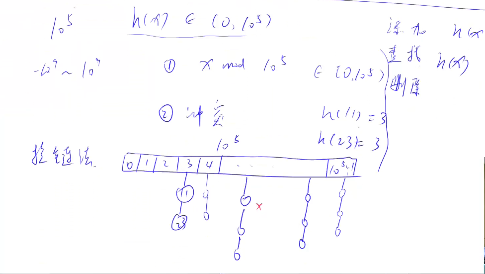

# AcWing 算法基础课 -- 数据结构

## AcWing 840. 模拟散列表 

`难度：简单`

### 题目描述

维护一个集合，支持如下几种操作：

- “I x”，插入一个数x；
- “Q x”，询问数x是否在集合中出现过；

现在要进行N次操作，对于每个询问操作输出对应的结果。

**输入格式**

第一行包含整数N，表示操作数量。

接下来N行，每行包含一个操作指令，操作指令为”I x”，”Q x”中的一种。

**输出格式**

对于每个询问指令“Q x”，输出一个询问结果，如果x在集合中出现过，则输出“Yes”，否则输出“No”。

每个结果占一行。

**数据范围**

$1≤N≤10^5$

$−10^9≤x≤10^9$

```r
输入样例：

5
I 1
I 2
I 3
Q 2
Q 5

输出样例：

Yes
No
```

### Solution

模拟散列表要注意两点：1. 哈希算法：x mod $10^5$(取模的值尽量取成质数，开放寻址法要取 2~3 倍的空间)；2. 解决冲突，开放寻址法或者拉链法。

1. 拉链法

```java
import java.util.*;
import java.io.*;

class Main{
    // 拉链法，哈希到相同位置拉一条单链表出来
    // 单链表就是用数组来模拟单链表，之前的例题已经做过了
    // N 要取最接近 100000 的质数
    public static int N = 100003;
    // h 数组下标是 x 哈希之后的值，存储的值相应 idx
    public static int[] h = new int[N];
    // e[idx] 表示 h 引出单链表下标为 idx 的值
    public static int[] e = new int[N];
    // ne[idx] 存储下标为 idx 的下一个位置的下标
    public static int[] ne = new int[N];
    // idx 单链表的下标，从 1 开始，因为 h 数组初始化为 0 代表空，如果 idx 从 0 开始，会矛盾
    public static int idx = 1;
    public static void main(String[] args) throws IOException{
        BufferedReader br = new BufferedReader(new InputStreamReader(System.in));
        BufferedWriter bw = new BufferedWriter(new OutputStreamWriter(System.out));
        int n = Integer.parseInt(br.readLine());
        String[] s;
        while(n-- > 0){
            s = br.readLine().split(" ");
            int x = Integer.parseInt(s[1]);
            if(s[0].equals("I")){
                insert(x);
            }
            else{
                boolean flag = query(x);
                if(flag) bw.write("Yes\n");
                else bw.write("No\n");
            }
        }
        bw.close();
        br.close();
    }
    public static void insert(int x){
        // 将 x 进行 hash 处理，+N 是为了防止负数取模仍然为负数
        int k = (x % N + N) % N;
        // 就是一个单链表,把 h[k] 当成头
        e[idx] = x;
        ne[idx] = h[k];
        h[k] = idx;
        idx++;
    }
    public static boolean query(int x){
        int k = (x % N + N) % N;
        // 从 h[k] 开始找,如果 i == 0,说明一条链表找完了
        for(int i = h[k]; i != 0; i = ne[i]){
            if(e[i] == x) return true;
        }
        return false;
    }
}
```

2. 开放寻址法

```java
import java.util.*;
import java.io.*;

public class Main{
    // N 初始化 2~3 倍空间的第一个质数
    public static final int N = 200003;
    public static final int NULL = 0x3f3f3f3f;
    public static int[] h = new int[N];
    public static void main(String[] args) throws IOException{
        BufferedReader br = new BufferedReader(new InputStreamReader(System.in));
        BufferedWriter bw = new BufferedWriter(new OutputStreamWriter(System.out));
        int n = Integer.parseInt(br.readLine());
        String[] s;
        // 初始化一个比 x 上限大的值
        Arrays.fill(h, NULL);
        while(n-- > 0){
            s = br.readLine().split(" ");
            int x = Integer.parseInt(s[1]);
            if(s[0].equals("I")){
                int idx = find(x);
                h[idx] = x;
            }
            else{
                if(h[find(x)] == NULL) bw.write("No\n");
                else bw.write("Yes\n");
            }
        }
        bw.close();
        br.close();
    }
    public static int find(int x){
        int k = (x % N + N) % N;
        while(h[k] != NULL && h[k] != x){
            k ++;
            if(k == N) k = 0;
        }
        return k;
    }
}
```

### yxc




我先按“题型与考点 → 核心思路与做法 → 代码实现 → 为什么能想到”这个顺序，直接带你学这道题。题目与题解都来自你上传的文件：

这题是 **哈希表 / 散列表的模板题**。它的任务非常单纯：维护一个集合，只支持两种操作：

* 插入一个数 `x`
* 询问一个数 `x` 是否出现过

---

## 一、题型与核心考点

这题属于 **数据结构里的哈希表**，更具体地说，是：

* **集合判重 / 集合查询**
* **用哈希把“值域很大”的整数映射到“小范围数组”**
* **处理哈希冲突**

核心考点其实就两个：

### 1）哈希函数

把一个整数 `x` 映射到数组下标里，常见写法就是：

```java
int k = (x % N + N) % N;
```

这里这么写是因为题目里的 `x` 可能是负数，Java 里负数取模可能还是负数，所以要修正到 `[0, N-1]` 范围。

### 2）冲突处理

不同的数，哈希后可能落到同一个位置，所以必须解决冲突。你文件里给了两种经典方法：

* **拉链法**
* **开放寻址法**

---

## 二、核心思路与整体做法

### 先想朴素做法为什么不够好

这题如果朴素做：

#### 做法 1：每次查询都线性扫一遍

* 插入：直接存起来，`O(1)`
* 查询：遍历所有已插入元素，`O(n)`

如果一共有 `10^5` 次操作，最坏会到 `O(n^2)`，不行。

#### 做法 2：开一个大数组直接标记

比如 `vis[x] = true`。

但题目里 `x` 范围是 `-10^9 ~ 10^9`，值域太大，不可能直接开这么大的数组。

#### 做法 3：平衡树 / TreeSet

可以做，插入和查询都是 `O(log n)`。

但这题是哈希模板题，想要的是 **平均 `O(1)`** 的集合操作，所以最适合用散列表。

---

### 这题为什么天然适合哈希表

因为它只有两件事：

* 插入一个数
* 判断某个数在不在集合中

这正是哈希表最擅长的场景：**快速判存在**。

---

## 三、两种解法的核心思路

---

### 解法一：拉链法

#### 1. 本质理解

你可以把哈希表想成一个“桶数组”。

* 每个数 `x` 先算出一个桶号 `k`
* `k` 这个桶里可能不止一个数
* 所有哈希到同一个桶的数，串成一条链表

所以：

* 插入 `x`：把它插到 `k` 号桶对应链表的头部
* 查询 `x`：去 `k` 号桶那条链里找有没有它

---

#### 2. 为什么叫“拉链法”

因为一个桶里冲突的元素，不是硬塞在同一个格子里，而是“拉出一条链”来存。

---

#### 3. 时间复杂度怎么理解

* 平均插入：`O(1)`
* 平均查询：`O(1)`

因为如果哈希函数比较均匀，元素会比较平均地分布到各个桶里，每条链不会太长。

---

### 解法二：开放寻址法

#### 1. 本质理解

开放寻址法不额外拉链表，而是：

* 先看哈希位置 `k`
* 如果这个位置空，就放这里
* 如果被占了，就继续往后找空位
* 查询时也按同样规则一路往后找

也就是说，**所有元素都直接存在哈希数组里**，冲突时靠“往后探测”解决。

---

#### 2. 这题里为什么能这样做

因为这题只有：

* 插入
* 查询

**没有删除**

开放寻址法最怕的是删除处理麻烦，但这题没有删除，所以非常适合。

---

#### 3. 为什么数组要开大一点

因为开放寻址法冲突后会往后探测，如果表太满，查找和插入都会越来越慢。

所以文件里说要开成 **2~3 倍空间**，并且通常也取一个质数。

---

## 四、代码实现讲解

下面开始讲你文件里的代码实现，但我会和“思路”分开讲。

---

# 1. 拉链法代码实现

你上传的代码核心结构是这几个数组：

```java
public static int N = 100003;
public static int[] h = new int[N];
public static int[] e = new int[N];
public static int[] ne = new int[N];
public static int idx = 1;
```

### 这套数组在干什么

这是“**用数组模拟单链表**”的经典写法：

* `h[k]`：第 `k` 个桶链表的头结点下标
* `e[idx]`：当前结点存的值
* `ne[idx]`：当前结点的下一个结点是谁
* `idx`：当前可以新开哪个结点位置

也就是说，哈希表的每个桶，本质上挂着一条单链表。

---

### 插入操作

```java
public static void insert(int x){
    int k = (x % N + N) % N;
    e[idx] = x;
    ne[idx] = h[k];
    h[k] = idx;
    idx++;
}
```

### 这段逻辑怎么理解

先做哈希：

```java
int k = (x % N + N) % N;
```

表示 `x` 属于第 `k` 个桶。

然后头插法把它插进链表：

```java
e[idx] = x;
ne[idx] = h[k];
h[k] = idx;
```

也就是：

* 新结点存 `x`
* 新结点指向原来的表头
* 桶头改成新结点

这就是单链表头插。

---

### 查询操作

```java
public static boolean query(int x){
    int k = (x % N + N) % N;
    for(int i = h[k]; i != 0; i = ne[i]){
        if(e[i] == x) return true;
    }
    return false;
}
```

### 查询逻辑怎么理解

先找到 `x` 所在桶 `k`，然后只在这一条链上查，不需要扫整个集合。

因为如果 `x` 存在，它一定只可能出现在自己哈希到的那个桶里。

这就是哈希表比朴素遍历快得多的原因。

---

### 主函数在做什么

```java
if(s[0].equals("I")){
    insert(x);
}
else{
    boolean flag = query(x);
    if(flag) bw.write("Yes\n");
    else bw.write("No\n");
}
```

就是按照题目要求模拟操作：

* `I x` 就插入
* `Q x` 就查询并输出

---

# 2. 开放寻址法代码实现

你文件里的开放寻址法代码是这个思路：

```java
public static final int N = 200003;
public static final int NULL = 0x3f3f3f3f;
public static int[] h = new int[N];
```

---

### 为什么要有 `NULL`

因为开放寻址法里，数组 `h[k]` 直接存值。

那就需要一个“特殊值”表示这个位置还没用过，所以用：

```java
NULL = 0x3f3f3f3f
```

它比题目里 `x` 的范围大，不会和真实数据冲突。

然后：

```java
Arrays.fill(h, NULL);
```

把整个哈希表先初始化成“空”。

---

### 最关键的函数：`find(x)`

```java
public static int find(int x){
    int k = (x % N + N) % N;
    while(h[k] != NULL && h[k] != x){
        k ++;
        if(k == N) k = 0;
    }
    return k;
}
```

这个函数特别重要，你一定要理解它。

它的含义不是“查找是否存在”，而是：

> **返回 x 应该在的位置。**

可能有两种情况：

* 如果 `x` 已经存在，就返回 `x` 所在的位置
* 如果 `x` 不存在，就返回它最终应该插入的空位置

所以这个函数同时服务于：

* 插入
* 查询

---

### 插入为什么这么写

```java
int idx = find(x);
h[idx] = x;
```

因为 `find(x)` 找到的要么是 `x` 本身的位置，要么是它该去的空位。

直接赋值即可。

即使重复插入同一个数，也没问题，因为如果已经存在，`find(x)` 返回的就是原位置，再赋值一次而已。

---

### 查询为什么这么写

```java
if(h[find(x)] == NULL) bw.write("No\n");
else bw.write("Yes\n");
```

因为：

* 如果 `x` 存在，`find(x)` 返回存它的位置，那这里就不是 `NULL`
* 如果 `x` 不存在，`find(x)` 一路探测后会停在第一个空位，这时就是 `NULL`

所以用这个判断就行。

---

## 五、这两种方法怎么选

这题里两种都对。

### 拉链法特点

* 结构更清晰
* 冲突逻辑更直观
* 本质上是“数组 + 链表”

### 开放寻址法特点

* 写法更短
* 不需要额外链表数组
* 但对空间大小更敏感

对于初学阶段，我更建议你先把 **拉链法彻底理解透**，因为它更容易看出“冲突到底是怎么解决的”。

---

## 六、为什么能想到这种解法

这个部分最重要，是帮你建立“题型识别能力”。

### 1. 看到什么信号，应该想到哈希表？

当题目出现下面这些特征时，要优先想到哈希：

* 维护一个集合或映射
* 频繁判断某个数是否出现过
* 只有插入、查询、计数这类操作
* 值域很大，不能直接开数组
* 希望复杂度接近 `O(1)`

这题完全符合。

---

### 2. 为什么不是别的数据结构？

#### 不是普通数组

因为值域太大。

#### 不是线性表

因为查询太慢。

#### 不是树

树也能做，但 `O(log n)` 不是这题最想考的点。

#### 就是哈希表

因为它最适合“**快速判存在**”。

---

### 3. 为什么这里要学两种冲突处理？

因为“哈希后冲突”是散列表绕不开的问题。

所以学习哈希表时，真正核心不是“取模”，而是：

> **冲突了怎么办？**

这就是这题真正想让你掌握的东西。

* 拉链法：冲突元素挂链表
* 开放寻址法：冲突元素往后找位置

---

### 4. 方法迁移

以后你再看到下面这些题型，都可以往哈希上靠：

* 判重
* 两数之和
* 统计某个数出现次数
* 判断某个前缀和是否出现过
* 用集合维护“出现过的状态”

也就是说，**只要题目的核心是“快速找某个值在不在”**，哈希表都是高频思路。

---

## 七、你这道题最应该记住的不是代码，而是这几个点

### 拉链法你要记住

* 每个桶挂一条链
* 插入就是链表头插
* 查询就是在桶对应链表里找

### 开放寻址法你要记住

* 冲突了就往后探测
* `find(x)` 返回的是“x 的位置或应插入位置”
* 这题没有删除，所以开放寻址法很好用

---

接下来你最适合做的一步，是我带你把这题的 **拉链法模板压缩成你考试时最容易默写的版本**。

# 解释一下h、e、ne的意义，为什么一定要这样写
可以，这一块其实是 **拉链法里最容易“看代码会写、但不知道为什么这么设计”** 的地方。

先给你一个结论：

> `h、e、ne` 不是散列表本身独有的神秘写法，
> 它本质上是 **“用数组模拟单链表”**。
> 散列表的每个桶，后面都挂着一条链表，所以才会这样设计。

---

# 一、先说整体：这三个数组各自代表什么

我们先看这几句：

```java
int[] h = new int[N];
int[] e = new int[N];
int[] ne = new int[N];
int idx = 1;
```

它们的含义分别是：

### 1）`h[k]`

表示：

> 第 `k` 个桶的链表头结点是谁

也就是说，`h` 不是存具体的数，而是存“头结点下标”。

你可以把它理解成：

* `k` 是哈希桶编号
* `h[k]` 是这个桶对应链表的起点

---

### 2）`e[i]`

表示：

> 第 `i` 个结点里存的值是多少

比如：

```java
e[3] = 17;
```

意思就是：编号为 3 的这个链表结点，存的是 `17`。

---

### 3）`ne[i]`

表示：

> 第 `i` 个结点的下一个结点是谁

也就是单链表里的 `next`。

比如：

```java
ne[3] = 5;
```

表示：3 号结点的下一个结点是 5 号结点。

---

# 二、为什么会需要这三个数组

因为这题的拉链法，本质是这样：

* 哈希后得到一个桶 `k`
* 同一个桶里可能有多个数
* 所以每个桶后面要挂一条链表

但是 Java 里如果你直接写 `Node` 链表，也能做，只是模板题里更常用 **数组模拟链表**，因为：

* 更快
* 更稳定
* 更适合竞赛/算法模板
* 不需要频繁 new 节点对象

所以才会把“链表节点”拆成数组来存。

---

# 三、为什么要拆成 `h、e、ne`，而不是只用一个数组

这是关键。

因为链表里的一个结点，至少要有两部分信息：

* 这个结点存的值
* 这个结点指向谁

所以至少要有：

* `e[i]`：值
* `ne[i]`：next 指针

但是仅有这两个还不够，因为你还得知道：

> 每个桶对应的链表从哪里开始

所以还要一个：

* `h[k]`：桶 `k` 的表头

于是就变成：

* `h`：每条链的入口
* `e`：每个结点存什么
* `ne`：每个结点连到哪里

这三者缺一不可。

---

# 四、它们之间到底是什么关系

你可以把它们想成下面这样：

## 1. `h` 管“桶”

比如：

```java
h[7] = 3;
```

表示：

> 哈希到 7 号桶的那条链表，头结点是 3 号结点

---

## 2. `e` 管“结点里装什么”

比如：

```java
e[3] = 15;
```

表示：

> 3 号结点存的是 15

---

## 3. `ne` 管“结点怎么串起来”

比如：

```java
ne[3] = 8;
```

表示：

> 3 号结点的下一个结点是 8 号结点

---

所以如果有：

```java
h[7] = 3
e[3] = 15
ne[3] = 8
e[8] = 22
ne[8] = 0
```

那就表示 7 号桶这条链是：

```java
15 -> 22
```

因为：

* 从 `h[7]` 出发，先到 3 号结点
* `e[3] = 15`
* 然后 `ne[3] = 8`，到 8 号结点
* `e[8] = 22`
* `ne[8] = 0`，结束

---

# 五、为什么插入一定写成这样

插入代码一般是：

```java
e[idx] = x;
ne[idx] = h[k];
h[k] = idx;
idx++;
```

这四句必须连起来理解。

假设现在要把 `x` 插到第 `k` 个桶。

---

## 第一句：`e[idx] = x`

表示新开一个结点，存入值 `x`

比如当前 `idx = 5`，那就是：

* 5 号结点存 `x`

---

## 第二句：`ne[idx] = h[k]`

表示：

> 新结点的 next，指向原来这条链的表头

这一步特别重要，因为你要把新结点接到链表最前面。

如果原来：

```java
h[k] = 2
```

说明原链表头是 2 号结点。

那么现在：

```java
ne[5] = 2;
```

就表示新结点 5 指向原来的头 2。

---

## 第三句：`h[k] = idx`

表示：

> 现在这条链的新表头变成新结点

也就是把桶头改掉。

原来是：

```java
h[k] = 2
```

现在变成：

```java
h[k] = 5
```

所以整条链就从 `5` 开始了。

---

## 第四句：`idx++`

表示下一个新结点去下一个位置存。

---

# 六、为什么常常用“头插法”

因为头插最方便。

如果你想尾插，就得先找到尾结点，比较麻烦。

而头插只要三步：

1. 新结点存值
2. 新结点指向原头
3. 桶头改成新结点

复杂度是 `O(1)`，很适合模板题。

而且这题只要求：

* 能插入
* 能查询

根本不关心链表里元素的先后顺序，所以头插最好用。

---

# 七、为什么查询写成这样

查询一般写：

```java
for (int i = h[k]; i != 0; i = ne[i]) {
    if (e[i] == x) return true;
}
```

这句的意思是：

* 从桶 `k` 的链表头开始
* 沿着 `ne` 一直往后走
* 看每个结点存的值 `e[i]` 是否等于 `x`

这里就能看出三者分工特别明确：

* `h[k]`：从哪开始查
* `e[i]`：当前结点的值
* `ne[i]`：下一个去哪

如果没有这三个数组配合，链表根本走不起来。

---

# 八、为什么“不一定非得这样写”，但模板里通常都这样写

这里我得帮你纠正一下“**一定**”这个理解。

其实不是说 **只能** 这样写，而是说：

> **如果你要用数组模拟链表的拉链法，那就基本会写成这种结构。**

你也可以写成别的形式，比如：

### 写法 1：用 Java 对象链表

```java
class Node {
    int val;
    Node next;
}
```

也能实现拉链法。

但是在算法题里不常作为模板主流，因为：

* 代码更长
* new 对象更麻烦
* 常数更大
* 不如数组写法直接

---

### 写法 2：用 `ArrayList<Integer>[]`

每个桶挂一个 `ArrayList`

也可以，但这已经不是“数组模拟单链表”的经典模板了。

---

所以更准确的说法应该是：

> 不是“散列表一定只能这样写”，
> 而是“**当你选择数组模拟链表来写拉链法时，h、e、ne 这套结构最自然、最经典**”。

---

# 九、你可以把它记成一句话

## `h、e、ne` 的本质

就是：

> **h 找链表入口，e 存结点值，ne 连下一个结点。**

---

# 十、再给你一个非常小的例子

假设某两个数 `1` 和 `6` 哈希后都落到桶 `1`。

一开始桶 1 是空的：

```java
h[1] = 0
```

---

## 插入 1

```java
e[1] = 1
ne[1] = h[1] = 0
h[1] = 1
```

现在桶 1 对应的链表是：

```java
1
```

---

## 再插入 6

```java
e[2] = 6
ne[2] = h[1] = 1
h[1] = 2
```

现在桶 1 对应链表变成：

```java
6 -> 1
```

所以你查找时：

* 从 `h[1] = 2` 开始
* `e[2] = 6`
* `ne[2] = 1`
* `e[1] = 1`
* `ne[1] = 0` 结束

这就把冲突元素串起来了。

---

# 十一、你真正要理解的核心

你别把 `h、e、ne` 当成要死记的“黑魔法”。

它其实只是这件事的数组版表达：

* 一个桶后面挂一条链表
* 链表结点要存值
* 链表结点要指向下一个
* 每条链还得知道头是谁

于是自然就需要：

* `h`：头
* `e`：值
* `ne`：next

这就是它为什么这样写。

---

你现在最值得继续追的一步，是把 **“插入一遍以后，h/e/ne 分别变成什么”** 亲手推两次。这样这套写法就彻底不会混了。


```java
import java.io.*;

class Main {
    public static int N = 100003;
    /*
    数组模拟单链表所使用的三个数组
    head存所有的头节点，这里也是哈希表的所有桶
    val存所有节点的值
    next存所有节点的下一个节点
     */
    public static int[] head = new int[N];
    public static int[] val = new int[N];
    public static int[] next = new int[N];
    public static int cur = 1;
    public static void main(String[] args) throws IOException {
        BufferedReader bufferedReader = new BufferedReader(new InputStreamReader(System.in));
        BufferedWriter bufferedWriter = new BufferedWriter(new OutputStreamWriter(System.out));
        String[] input = bufferedReader.readLine().split(" ");
        int n = Integer.parseInt(input[0]);

        while (n-- > 0) {
            input = bufferedReader.readLine().split(" ");
            char ch = input[0].charAt(0);
            int x = Integer.parseInt(input[1]);
            if (ch == 'Q') {
                if (query(x)) System.out.println("Yes");
                else System.out.println("No");
            }
            else insert(x);
        }


        bufferedReader.close();
        bufferedWriter.close();
    }

    public static boolean query(int x) {
        //这里的哈希函数避免了负数k
        int k = (x % N + N) % N;
        if (head[k] == 0){
            return false;
        }
        k = head[k];
        while (k != 0) {
            if (val[k] == x) {
                return true;
            }
            k = next[k];
        }
        return false;
    }

    public static void insert(int x) {
        if (query(x)) return;
        int k = (x % N + N) % N;
        val[cur] = x;
        next[cur] = head[k];
        head[k] = cur;
        cur++;
    }

}
```