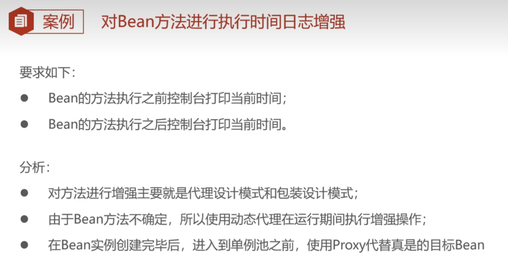
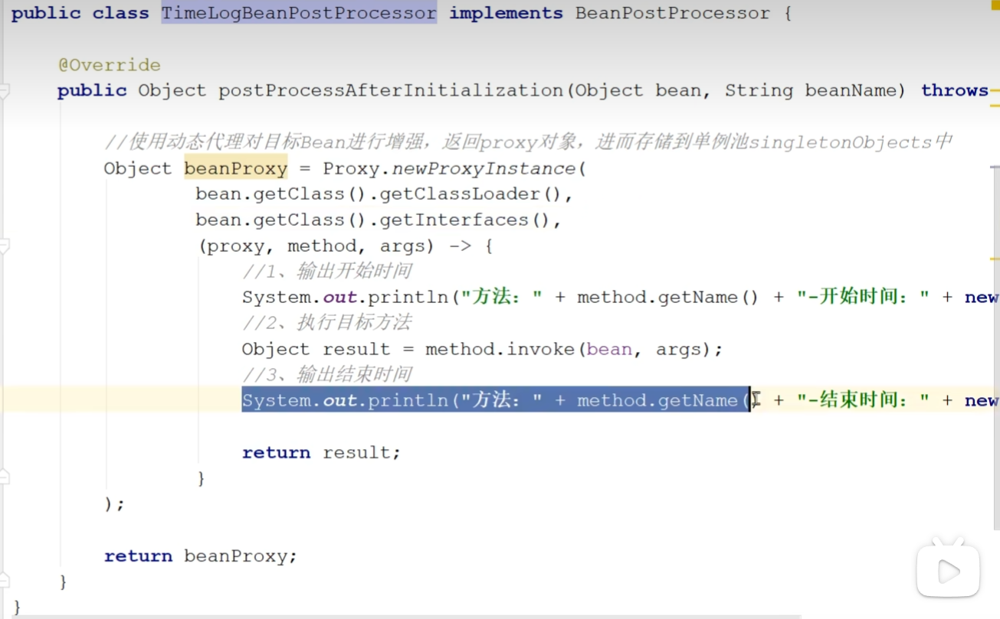

<style>
body {
  font-family: "PingFang SC", "Microsoft YaHei", "Noto Sans CJK SC", sans-serif;
  font-size: 14px;
  line-height: 1.7;
}
code, pre {
  font-family: "JetBrains Mono", "Cascadia Code", monospace;
}
</style>



这是我在课程上看到的一个例子，利用动态代理增强bean的功能。我想了解动态代理的作用就是增强对象的功能 吗？ 如图代码，代理是怎么使用的？ 最后讲解一下匿名内部类写成lambda表达式是怎么写的。

# 解答：
不只是“增强对象功能”这么简单。

动态代理的核心作用是：**不改原始对象代码，在调用它的方法前后或过程中，统一插入一层控制逻辑**。
“增强”只是最常见的表现之一。

比如它还能做这些事：

1. **日志**：方法执行前后打印时间、参数、返回值
2. **权限控制**：调用前先判断有没有权限
3. **事务管理**：调用前开启事务，异常时回滚
4. **性能统计**：统计方法耗时
5. **远程调用封装**：看起来像本地方法，实际背后发的是 RPC/HTTP 请求
6. **延迟加载**：真正用到对象时才创建
7. **拦截和过滤**：决定某些方法能不能执行，或者替换执行逻辑

所以更准确地说：

> 动态代理的作用是：**对目标对象的方法调用进行拦截、转发、包装和控制**。
> 增强只是其中一种典型用途。

---

## 一、你图里的代码，本质上在做什么

你这段代码是在 Spring 里写了一个 `BeanPostProcessor`，在 Bean 初始化完成后，把原来的 Bean 换成一个“代理对象”。

大致逻辑是这样：

```java
public class TimeLogBeanPostProcessor implements BeanPostProcessor {

    @Override
    public Object postProcessAfterInitialization(Object bean, String beanName) {
        Object beanProxy = Proxy.newProxyInstance(
                bean.getClass().getClassLoader(),
                bean.getClass().getInterfaces(),
                (proxy, method, args) -> {
                    System.out.println("方法：" + method.getName() + " 开始时间：" + new Date());
                    Object result = method.invoke(bean, args);
                    System.out.println("方法：" + method.getName() + " 结束时间：" + new Date());
                    return result;
                }
        );

        return beanProxy;
    }
}
```

---

## 二、这个代理是怎么被“使用”的

你可以把它理解成下面这个过程。

### 1）原本 Spring 创建的是目标对象

比如有一个业务类：

```java
public interface UserService {
    void test();
}
```

```java
public class UserServiceImpl implements UserService {
    @Override
    public void test() {
        System.out.println("执行业务方法");
    }
}
```

正常情况下，容器里放进去的是 `UserServiceImpl` 对象。

---

### 2）`BeanPostProcessor` 在初始化后拦截它

Spring 在 Bean 创建完成后，会回调：

```java
postProcessAfterInitialization(bean, beanName)
```

你在这里没有直接返回原始 `bean`，而是返回了：

```java
beanProxy
```

也就是说：

> Spring 最后放进容器里的，不再是原对象，而是代理对象。

---

### 3）以后别人拿到的其实是代理对象

当别的地方注入这个 Bean：

```java
@Autowired
private UserService userService;
```

这里拿到的其实不是 `UserServiceImpl` 原对象，而是代理对象。

---

### 4）调用方法时，先进入代理逻辑

比如执行：

```java
userService.test();
```

实际流程不是直接进 `UserServiceImpl.test()`，而是：

1. 先进入代理对象
2. 代理对象调用你写的 `invoke` / lambda 逻辑
3. 打印开始时间
4. 再反射调用真实对象的 `test()`
5. 打印结束时间
6. 返回结果

也就是：

```text
调用方 --> 代理对象 --> 你的增强逻辑 --> 真实对象方法 --> 返回结果
```

---

## 三、图中这三行代码分别是什么意思

### 1. `Proxy.newProxyInstance(...)`

这是 JDK 动态代理的入口，用来创建代理对象。

```java
Object beanProxy = Proxy.newProxyInstance(
    bean.getClass().getClassLoader(),
    bean.getClass().getInterfaces(),
    (proxy, method, args) -> { ... }
);
```

它有三个参数。

---

### 第一个参数：类加载器

```java
bean.getClass().getClassLoader()
```

表示用哪个类加载器去生成代理类。

一般就用目标对象自己的类加载器。

---

### 第二个参数：接口列表

```java
bean.getClass().getInterfaces()
```

JDK 动态代理的特点是：

> **它不是代理具体类，而是代理接口。**

所以这里要求目标类必须实现接口。
假设 `UserServiceImpl implements UserService`，那代理对象会“长得像”一个 `UserService`。

如果一个类没有实现接口，JDK 动态代理就不能直接代理，这时通常用 **CGLIB**。

---

### 第三个参数：调用处理器

```java
(proxy, method, args) -> { ... }
```

这其实就是 `InvocationHandler`。

意思是：

> 将来凡是调用代理对象的方法，都会先来到这里。

这里的三个参数含义是：

```java
(proxy, method, args)
```

* `proxy`：当前代理对象
* `method`：当前调用的是哪个方法
* `args`：这个方法的参数

---

## 四、你图里的增强逻辑是怎么工作的

你代码里的关键部分是：

```java
(proxy, method, args) -> {
    System.out.println("方法：" + method.getName() + " 开始时间：" + new Date());

    Object result = method.invoke(bean, args);

    System.out.println("方法：" + method.getName() + " 结束时间：" + new Date());

    return result;
}
```

解释如下。

### 先打印开始时间

```java
System.out.println(...)
```

这是“前置增强”。

---

### 再执行真实对象的方法

```java
Object result = method.invoke(bean, args);
```

这里很关键。

不是执行 `proxy`，而是执行真实对象 `bean` 的方法。
`method.invoke(bean, args)` 的意思是：

> 用反射调用目标对象 `bean` 的 `method` 方法，并传入参数 `args`

如果这里写成对 `proxy` 调用，就会再次进入代理逻辑，可能导致递归调用。

---

### 最后打印结束时间

这就是“后置增强”。

---

### 返回原方法结果

```java
return result;
```

这样调用方就能拿到真实方法返回值。

---

## 五、所以代理对象和真实对象各自做什么

可以这样记：

### 真实对象 `bean`

负责真正的业务逻辑。

### 代理对象 `beanProxy`

负责在调用真实对象前后加额外逻辑。

比如：

```java
代理对象：
    打日志
    开事务
    权限校验
    调用真实对象
    提交事务
```

这就是代理模式最典型的用法。

---

## 六、动态代理和静态代理区别是什么

### 静态代理

你要手写一个代理类。

例如：

```java
public class UserServiceProxy implements UserService {
    private UserService target;

    public UserServiceProxy(UserService target) {
        this.target = target;
    }

    @Override
    public void test() {
        System.out.println("开始时间");
        target.test();
        System.out.println("结束时间");
    }
}
```

缺点是：每个类都要写一遍，很重复。

---

### 动态代理

代理类不用你手写，运行时自动生成。

你只需要写一套拦截逻辑：

```java
(proxy, method, args) -> { ... }
```

这样能代理很多对象，更灵活。

---

## 七、你这个例子为什么放在 `BeanPostProcessor` 里

因为 Spring 想做的就是：

> 在对象交给用户使用之前，先偷偷把它替换成代理对象。

所以 `BeanPostProcessor` 很适合做这件事。

流程大概是：

1. Spring 创建原始 Bean
2. 初始化 Bean
3. 调用 `postProcessAfterInitialization`
4. 你返回代理对象
5. Spring 把代理对象放进容器
6. 以后别人用到的都是代理对象

这也是 Spring AOP 的核心思想之一。

---

## 八、匿名内部类改成 lambda 是怎么变的

你图里的 lambda：

```java
(proxy, method, args) -> {
    System.out.println("开始");
    Object result = method.invoke(bean, args);
    System.out.println("结束");
    return result;
}
```

它原本对应的是匿名内部类写法。

### 匿名内部类写法

```java
InvocationHandler handler = new InvocationHandler() {
    @Override
    public Object invoke(Object proxy, Method method, Object[] args) throws Throwable {
        System.out.println("开始");
        Object result = method.invoke(bean, args);
        System.out.println("结束");
        return result;
    }
};
```

然后传给：

```java
Object beanProxy = Proxy.newProxyInstance(
        bean.getClass().getClassLoader(),
        bean.getClass().getInterfaces(),
        handler
);
```

---

### 直接写成匿名内部类

也可以不单独定义变量，直接写进去：

```java
Object beanProxy = Proxy.newProxyInstance(
        bean.getClass().getClassLoader(),
        bean.getClass().getInterfaces(),
        new InvocationHandler() {
            @Override
            public Object invoke(Object proxy, Method method, Object[] args) throws Throwable {
                System.out.println("开始");
                Object result = method.invoke(bean, args);
                System.out.println("结束");
                return result;
            }
        }
);
```

---

### 再简化成 lambda

因为 `InvocationHandler` 是**函数式接口**，只有一个抽象方法：

```java
Object invoke(Object proxy, Method method, Object[] args) throws Throwable;
```

所以可以写成 lambda：

```java
Object beanProxy = Proxy.newProxyInstance(
        bean.getClass().getClassLoader(),
        bean.getClass().getInterfaces(),
        (proxy, method, args) -> {
            System.out.println("开始");
            Object result = method.invoke(bean, args);
            System.out.println("结束");
            return result;
        }
);
```

---

## 九、匿名内部类为什么能改成 lambda

前提只有一个：

> 这个接口必须是**函数式接口**，也就是只有一个抽象方法。

例如 `InvocationHandler` 就满足：

```java
public interface InvocationHandler {
    Object invoke(Object proxy, Method method, Object[] args) throws Throwable;
}
```

所以能改。

但不是所有匿名内部类都能改成 lambda。
如果接口里有多个抽象方法，就不能这么写。

---

## 十、lambda 的语法是怎么一步步简化的

还是这个方法签名：

```java
Object invoke(Object proxy, Method method, Object[] args) throws Throwable
```

### 第一步：完整匿名内部类

```java
new InvocationHandler() {
    @Override
    public Object invoke(Object proxy, Method method, Object[] args) throws Throwable {
        return method.invoke(bean, args);
    }
}
```

### 第二步：去掉类名、方法名，保留参数和方法体

```java
(Object proxy, Method method, Object[] args) -> {
    return method.invoke(bean, args);
}
```

### 第三步：类型可推断时，参数类型可以省略

```java
(proxy, method, args) -> {
    return method.invoke(bean, args);
}
```

### 第四步：如果方法体只有一行，且是返回值，可以再简写

```java
(proxy, method, args) -> method.invoke(bean, args)
```

但你这个例子里有多行打印逻辑，所以还是要保留大括号。

---

## 十一、这个例子有一个实际限制

你图里的写法是 **JDK 动态代理**，所以有个前提：

> 目标 Bean 必须实现接口。

例如：

```java
class AService { ... }
```

如果它没有实现任何接口，那么：

```java
bean.getClass().getInterfaces()
```

可能拿不到你想要的接口，JDK 代理就无法正常代理业务方法。

这时通常用：

* **CGLIB 动态代理**
* Spring AOP 在很多场景下也会自动选择合适方式

可以简单记：

* **有接口**：优先 JDK 动态代理
* **没接口**：通常 CGLIB

---

## 十二、你可以把这个例子记成一句话

这个案例本质上是：

> Spring 在 Bean 初始化后，用 JDK 动态代理生成一个代理对象，把原 Bean 包起来；以后对 Bean 方法的调用，先进入代理逻辑，再转发到真实对象，从而实现统一的日志增强。

---

如果你愿意，我可以下一条直接给你画一张“Spring 创建 Bean → 返回代理 → 调用代理 → 执行真实对象”的流程图，并顺手补上 JDK 动态代理和 CGLIB 的区别。

# 请给我一个完整的例子演示一下JKD动态代理怎么用的，而不要深入的讲解其原理

可以。下面直接给你一个**能跑通的完整例子**，你照着写一遍，基本就能看懂“怎么用”。

这个例子做的事很简单：

* 有一个真实对象 `UserServiceImpl`
* 用 `Proxy.newProxyInstance(...)` 给它生成一个代理对象
* 以后不直接调真实对象，而是调代理对象
* 调代理对象时，先打印开始时间，再执行业务方法，再打印结束时间

---

# 一、完整示例

## 1）接口

```java
public interface UserService {
    void addUser(String name);
    String getUser(int id);
}
```

---

## 2）真实对象

```java
public class UserServiceImpl implements UserService {

    @Override
    public void addUser(String name) {
        System.out.println("正在新增用户：" + name);
    }

    @Override
    public String getUser(int id) {
        System.out.println("正在查询用户，id = " + id);
        return "用户-" + id;
    }
}
```

---

## 3）代理工厂

这里就是你课程里看到的那种写法，入口就是：

```java
Proxy.newProxyInstance(...)
```

```java
import java.lang.reflect.Proxy;
import java.util.Arrays;
import java.util.Date;

public class ProxyFactory {

    public static Object createProxy(Object target) {
        return Proxy.newProxyInstance(
                target.getClass().getClassLoader(),
                target.getClass().getInterfaces(),
                (proxy, method, args) -> {
                    System.out.println("===== 方法执行前 =====");
                    System.out.println("方法名：" + method.getName());
                    System.out.println("参数：" + Arrays.toString(args));
                    System.out.println("开始时间：" + new Date());

                    Object result = method.invoke(target, args);

                    System.out.println("结束时间：" + new Date());
                    System.out.println("返回值：" + result);
                    System.out.println("===== 方法执行后 =====");
                    return result;
                }
        );
    }
}
```

---

## 4）测试类

```java
public class TestMain {
    public static void main(String[] args) {
        // 1. 创建真实对象
        UserService target = new UserServiceImpl();

        // 2. 创建代理对象
        UserService proxy = (UserService) ProxyFactory.createProxy(target);

        // 3. 调用代理对象的方法
        proxy.addUser("张三");
        System.out.println();

        String result = proxy.getUser(1001);
        System.out.println("main中拿到返回值：" + result);
    }
}
```

---

# 二、运行效果

大概会输出：

```java
===== 方法执行前 =====
方法名：addUser
参数：[张三]
开始时间：Mon Mar 24 10:00:00 CST 2026
正在新增用户：张三
结束时间：Mon Mar 24 10:00:00 CST 2026
返回值：null
===== 方法执行后 =====

===== 方法执行前 =====
方法名：getUser
参数：[1001]
开始时间：Mon Mar 24 10:00:01 CST 2026
正在查询用户，id = 1001
结束时间：Mon Mar 24 10:00:01 CST 2026
返回值：用户-1001
===== 方法执行后 =====
main中拿到返回值：用户-1001
```

---

# 三、你真正要怎么理解“怎么用”

你先只记住这 4 步：

### 第 1 步：写一个接口

```java
public interface UserService {
    void addUser(String name);
}
```

### 第 2 步：写一个实现类

```java
public class UserServiceImpl implements UserService {
    public void addUser(String name) {
        System.out.println("新增用户：" + name);
    }
}
```

### 第 3 步：把真实对象传给 `Proxy.newProxyInstance(...)`

```java
UserService target = new UserServiceImpl();
UserService proxy = (UserService) ProxyFactory.createProxy(target);
```

### 第 4 步：以后调用 `proxy.xxx()`，不要调用 `target.xxx()`

```java
proxy.addUser("张三");
```

就是这么用。

---

# 四、你课程图里的那种“打印方法执行前后时间”，用这个例子对应起来

你图里的核心逻辑就是这一段：

```java
(proxy, method, args) -> {
    System.out.println("开始时间：" + new Date());
    Object result = method.invoke(target, args);
    System.out.println("结束时间：" + new Date());
    return result;
}
```

你可以把它看成一个统一模板：

```java
(proxy, method, args) -> {
    // 方法执行前做点事

    Object result = method.invoke(target, args);

    // 方法执行后做点事

    return result;
}
```

所以以后你想加什么都行，比如：

* 打日志
* 统计耗时
* 权限校验
* 异常处理

---

# 五、再给你一个更贴近课程截图的版本

如果你只想做“执行前后打印当前时间”，可以简化成这样：

## 1）接口

```java
public interface OrderService {
    void createOrder();
}
```

## 2）真实类

```java
public class OrderServiceImpl implements OrderService {
    @Override
    public void createOrder() {
        System.out.println("创建订单中...");
    }
}
```

## 3）测试

```java
import java.lang.reflect.Proxy;
import java.util.Date;

public class Demo {
    public static void main(String[] args) {
        OrderService target = new OrderServiceImpl();

        OrderService proxy = (OrderService) Proxy.newProxyInstance(
                target.getClass().getClassLoader(),
                target.getClass().getInterfaces(),
                (proxyObj, method, methodArgs) -> {
                    System.out.println("方法执行前时间：" + new Date());

                    Object result = method.invoke(target, methodArgs);

                    System.out.println("方法执行后时间：" + new Date());
                    return result;
                }
        );

        proxy.createOrder();
    }
}
```

这个例子就和你课上看到的非常接近。

---

# 六、匿名内部类版本

如果你不想先看 lambda，也可以先看成匿名内部类写法：

```java
import java.lang.reflect.InvocationHandler;
import java.lang.reflect.Method;
import java.lang.reflect.Proxy;
import java.util.Date;

public class Demo {
    public static void main(String[] args) {
        OrderService target = new OrderServiceImpl();

        OrderService proxy = (OrderService) Proxy.newProxyInstance(
                target.getClass().getClassLoader(),
                target.getClass().getInterfaces(),
                new InvocationHandler() {
                    @Override
                    public Object invoke(Object proxyObj, Method method, Object[] methodArgs) throws Throwable {
                        System.out.println("方法执行前时间：" + new Date());

                        Object result = method.invoke(target, methodArgs);

                        System.out.println("方法执行后时间：" + new Date());
                        return result;
                    }
                }
        );

        proxy.createOrder();
    }
}
```

---

# 七、再改成 lambda

因为这里只需要实现一个方法 `invoke(...)`，所以可以简写成：

```java
(proxyObj, method, methodArgs) -> {
    System.out.println("方法执行前时间：" + new Date());
    Object result = method.invoke(target, methodArgs);
    System.out.println("方法执行后时间：" + new Date());
    return result;
}
```

所以完整写法就变成了你课上看到的样子。

---

# 八、你直接照着练的最小版本

这个最适合你先跑一下：

```java
import java.lang.reflect.Proxy;
import java.util.Date;

interface HelloService {
    void sayHello();
}

class HelloServiceImpl implements HelloService {
    @Override
    public void sayHello() {
        System.out.println("Hello，真正的方法执行了");
    }
}

public class Main {
    public static void main(String[] args) {
        HelloService target = new HelloServiceImpl();

        HelloService proxy = (HelloService) Proxy.newProxyInstance(
                target.getClass().getClassLoader(),
                target.getClass().getInterfaces(),
                (proxyObj, method, methodArgs) -> {
                    System.out.println("开始时间：" + new Date());
                    Object result = method.invoke(target, methodArgs);
                    System.out.println("结束时间：" + new Date());
                    return result;
                }
        );

        proxy.sayHello();
    }
}
```

---

# 九、你先只记一个使用结论

> 真实对象负责真正干活。
> 代理对象负责在“真正干活前后”加你想加的代码。
> 实际使用时，调用的是代理对象，不是原始对象。

---

你要的话，我下一条可以直接把这个例子改成 **Spring 里的 Bean 版本**，让你一眼看懂它和你课上 `BeanPostProcessor` 那张图是怎么对应起来的。
