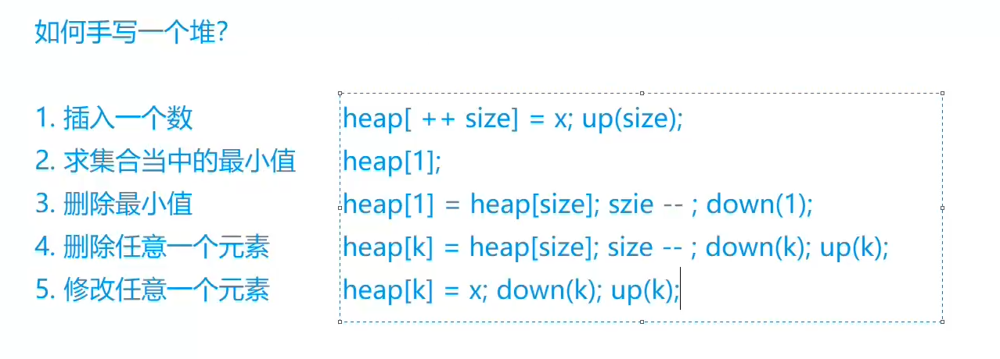
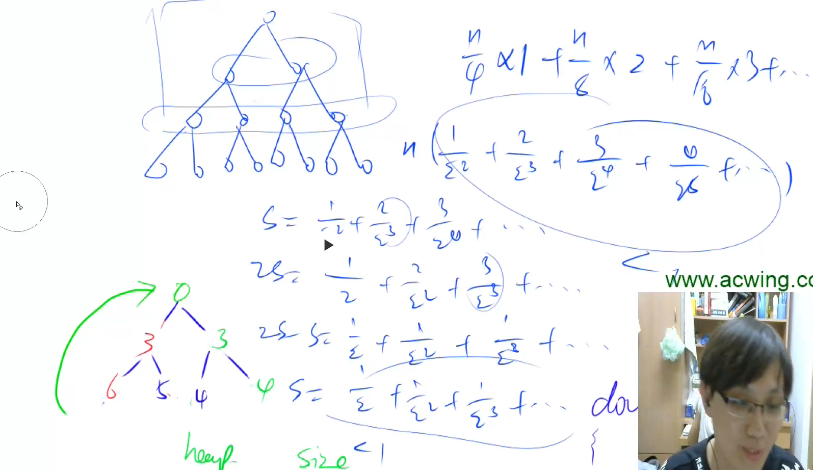

# AcWing 算法基础课 -- 数据结构

## AcWing 838. 堆排序

`难度：简单`

### 题目描述

输入一个长度为n的整数数列，从小到大输出前m小的数。

**输入格式**

第一行包含整数n和m。

第二行包含n个整数，表示整数数列。

**输出格式**

共一行，包含m个整数，表示整数数列中前m小的数。

**数据范围**

$1≤m≤n≤10^5$，
$1≤数列中元素≤10^9$

```r
5 3
4 5 1 3 2

输出样例：

1 2 3
```

### Solution

```java
import java.util.*;
import java.io.*;

public class Main{
    public static final int N = 100010;
    public static int[] h = new int[N];
    public static int cnt = 0;
    public static void main(String[] args) throws IOException{
        BufferedReader br = new BufferedReader(new InputStreamReader(System.in));
        BufferedWriter bw = new BufferedWriter(new OutputStreamWriter(System.out));
        String[] s = br.readLine().split(" ");
        int n = Integer.parseInt(s[0]);
        int m = Integer.parseInt(s[1]);
        s = br.readLine().split(" ");
        // 初始化
        for(int i = 1; i <= n; i++)  h[i] = Integer.parseInt(s[i - 1]);
        cnt = n;
        // 建堆，从 n / 2 开始建堆，可以把复杂度降低到 O(n)
        for(int i = n / 2; i > 0; i--)    down(i);
        while(m-- > 0){
            bw.write(h[1] + " ");
            h[1] = h[cnt];
            cnt--;
            down(1);
        }
        bw.close();
        br.close();
    }
    public static void down(int u){
        int t = u;
        // 找到 u 点和他左右孩子的三个的最小值
        // 如果左右孩子有比 u 小的，就互换，然后递归下去
        if(2 * u <= cnt && h[2 * u] < h[t]) t = 2 * u;
        if(2 * u + 1 <= cnt && h[2 * u + 1] < h[t]) t = 2 * u + 1;
        if(u != t){
            swap(u, t);
            down(t);
        }
    }
    public static void swap(int u, int t){
        int temp = h[u];
        h[u] = h[t];
        h[t] = temp;
    }
}
```

### yxc

下标从 1 开始比较好，从 0 开始的画， `2 * 0` 还是 0



从 `1 ~ n/2`开始建堆，时间复杂度为 `O(n)`，证明如下



我们直接基于你上传的这份 `AcWing838 堆排序` 题目与题解来讲。

## 1. 题型与核心考点

这题属于 **堆 / 优先队列** 的经典入门题，核心考点有两个：

1. **小根堆的作用**
   堆顶永远是当前最小值，所以每次都能快速取出最小数。

2. **建堆 + 删除堆顶**
   先把整个数组建成小根堆，然后连续取出堆顶 `m` 次，就得到前 `m` 小的数。

这题虽然题目叫“堆排序”，但它和“把整个数组完整排好序”不完全一样。
因为题目只要求你输出 **前 m 小的数**，并不要求把全部 `n` 个数都排完。

---

## 2. 核心思路与整体做法

### 先想朴素做法

最直接的办法是：

* 把整个数组排序
* 输出前 `m` 个数

这样时间复杂度是：

* 排序：`O(n log n)`

这当然能过，因为 `n <= 10^5`，但这题的重点不是普通排序，而是让你理解：
**当我们只需要不断拿最小值时，堆更合适。**

---

### 这题为什么用小根堆

小根堆有一个很重要的性质：

* 根节点是最小值
* 删除最小值后，可以在 `O(log n)` 时间恢复堆结构

所以流程就是：

### 第一步：把所有数建成一个小根堆

这样堆顶 `h[1]` 就是全局最小值。

### 第二步：重复 `m` 次

每次做三件事：

1. 输出堆顶
2. 用最后一个元素覆盖堆顶
3. 堆的大小减一，再向下调整 `down(1)`

这样就能依次拿到第 1 小、第 2 小、……、第 `m` 小。

---

### 时间复杂度

这份题解的关键优化在于：

* **建堆是 `O(n)`**
* 每次取最小值并调整是 `O(log n)`，共做 `m` 次

总复杂度：

[
O(n + m \log n)
]

这比“完整排序后再取前 m 个”更贴合题意。
尤其当 `m` 明显小于 `n` 时，堆的思路更有针对性。

---

## 3. 题解代码如何实现

下面按代码结构来拆。

---

### （1）堆的存储方式

```java
public static final int N = 100010;
public static int[] h = new int[N];
public static int cnt = 0;
```

这里用数组 `h` 来模拟堆，并且采用 **下标从 1 开始** 的方式。

这样做的好处是：

* 左孩子：`2 * u`
* 右孩子：`2 * u + 1`

写起来最自然。

`cnt` 表示当前堆里有多少个元素。

---

### （2）读入并初始化堆

```java
for(int i = 1; i <= n; i++)  h[i] = Integer.parseInt(s[i - 1]);
cnt = n;
```

这里先把输入的 `n` 个数直接放进数组里。
注意：**这时候还不是堆**，只是普通数组。

---

### （3）建堆

```java
for(int i = n / 2; i > 0; i--)    down(i);
```

这是整题最关键的一步。

为什么从 `n / 2` 开始？

因为：

* `n / 2 + 1 ~ n` 这些点都是叶子节点
* 叶子节点本身已经满足堆性质，不需要调整
* 所以只需要从最后一个非叶子节点开始，向前依次 `down`

这样可以在线性时间 `O(n)` 内建好堆。

---

### （4）取出前 m 小的数

```java
while(m-- > 0){
    bw.write(h[1] + " ");
    h[1] = h[cnt];
    cnt--;
    down(1);
}
```

每轮操作的含义非常固定：

#### 第一步：输出堆顶

```java
bw.write(h[1] + " ");
```

因为小根堆的堆顶就是当前最小值。

#### 第二步：删除堆顶

```java
h[1] = h[cnt];
cnt--;
```

把最后一个元素放到堆顶，相当于删除原来的最小值。

#### 第三步：恢复堆结构

```java
down(1);
```

由于新的堆顶可能比孩子大，所以要从上往下调整。

---

### （5）`down(u)` 的含义

```java
public static void down(int u){
    int t = u;
    if(2 * u <= cnt && h[2 * u] < h[t]) t = 2 * u;
    if(2 * u + 1 <= cnt && h[2 * u + 1] < h[t]) t = 2 * u + 1;
    if(u != t){
        swap(u, t);
        down(t);
    }
}
```

这个函数的目标只有一句话：

> 让编号 `u` 这个位置往下走，直到以它为根的子树重新满足小根堆性质。

具体过程是：

1. 先假设最小值在自己这里，`t = u`
2. 比较左孩子，如果左孩子更小，就更新 `t`
3. 比较右孩子，如果右孩子更小，再更新 `t`
4. 如果发现最小的不是自己，而是某个孩子，就交换
5. 交换后，继续递归调整下去

本质上就是把“不合适的大元素”一路下沉。

---

### （6）交换函数

```java
public static void swap(int u, int t){
    int temp = h[u];
    h[u] = h[t];
    h[t] = temp;
}
```

这个就只是普通交换。

---

## 4. 为什么能想到这种解法

这是学习算法时最重要的部分。

### 看到什么条件，应该往“堆”上想？

这题的触发信号非常明显：

#### 信号 1：题目要你反复取最小值 / 最大值

比如这题要求：

* 从小到大输出前 `m` 小的数

这本质上就是：

* 先取最小值
* 再取次小值
* 再取第三小值……

只要你看到“**反复取最值**”，就要想到堆。

---

#### 信号 2：并不需要完整排序结果

这题不是要求整个数组升序输出，而只是要前 `m` 小。

这种“**只取部分最值**”的场景，很适合堆。
因为堆擅长的是：

* 快速找到当前最小值 / 最大值
* 快速删掉它
* 继续维护剩余部分

而不是一次性把所有元素排成严格有序。

---

### 朴素做法和当前做法的区别

#### 朴素做法：整体排序

* 目标：把所有数都排好
* 思路：哪怕后面的数你根本用不到，也照样排完

#### 当前做法：堆

* 目标：只关心当前最小是谁
* 思路：拿一个、删一个、再维护结构

所以你会发现：

* **排序** 解决的是“全局有序”
* **堆** 解决的是“动态拿最值”

这就是两者最本质的区别。

---

## 5. 方法迁移

这题学完之后，你要把它迁移到下面这类题型：

### 第一类：求前 k 小 / 前 k 大

例如：

* 最小的 `k` 个数
* 第 `k` 小的数
* 不断输出当前最小值

这类题优先想堆。

---

### 第二类：动态维护最值

例如：

* 每次插入一个数后，随时查询最小值
* 一边删一边取最小值 / 最大值

这类题也优先想堆。

---

### 第三类：合并、调度、贪心中的“反复取最小”

比如后面你学到：

* Huffman 树
* 合并果子
* 若干区间或任务按最小代价处理

很多本质都是“每次先取当前最小的几个元素”，堆会频繁出现。

---

## 6. 这道题你应该记住什么

这题不只是让你会写 `down()`，更重要的是记住这个识别方式：

> **只要题目本质是在反复取当前最小值/最大值，就优先考虑堆。**

而这题的标准套路就是：

1. 把所有数放进小根堆
2. 建堆 `O(n)`
3. 重复 `m` 次取堆顶并删除
4. 总复杂度 `O(n + m log n)`

这份 Java 题解本身就是标准写法，思路也是完全正确的。

你要是愿意，我下一步可以继续按这个顺序，给你讲这题里 **`down()` 为什么一定能维护堆性质**。


# 为什么for(int i = n / 2; i > 0; i--) down(i);这一句可以完成建立堆？

这个问题是堆里最核心的一个问题。

先直接给你结论：

> 因为从 `n/2` 到 `1`，正好把所有“非叶子节点”都依次做了一遍向下调整，最后整棵树就满足小根堆性质了。

下面我们慢慢拆开。

---

## 3. 为什么从 `n/2` 开始？

堆是完全二叉树，用数组存时：

* 左儿子：`2 * i`
* 右儿子：`2 * i + 1`

那么一个节点 `i` 只要满足：

[
2i > n
]

它就没有左儿子，也就一定是叶子节点。

所以叶子节点的范围就是：

[
\left\lfloor \frac{n}{2} \right\rfloor + 1 \text{ 到 } n
]

也就是说：

* `1 ~ n/2` 是非叶子节点
* `n/2+1 ~ n` 是叶子节点

---

### 为什么叶子节点不用管？

因为叶子节点没有孩子。

而堆的性质是：

> 每个节点都要不大于它的孩子（小根堆）

叶子节点下面没有孩子，所以它天然就满足堆性质。
因此建堆时，不需要对叶子节点做任何操作。

所以我们只需要处理：

```java
for (int i = n / 2; i > 0; i--)
```

---

## 4. 为什么从后往前 `down()` 就能建堆？

因为 `down(i)` 有一个隐含前提：

> 它默认 `i` 的左右子树已经是堆了，然后把 `i` 这个位置调整到正确位置。

这句话非常重要。

---

### 先看一个小根堆调整的逻辑

`down(i)` 做的事不是“把整棵树都变成堆”，而是：

> 在左右子树已经合法的前提下，把根节点 `i` 调整好。

所以如果你想让 `down(i)` 生效，最好先保证：

* `i` 的左子树已经是堆
* `i` 的右子树已经是堆

这样 `down(i)` 才能把以 `i` 为根的整棵子树变成堆。

---

### 为什么从后往前正好满足这个条件？

因为完全二叉树里，编号大的节点都在下面。

当你从 `n/2, n/2-1, ..., 1` 这样往前做时：

* 当前位置 `i` 的孩子编号一定比 `i` 大
* 所以它的孩子会先于它被处理

也就是说，当你处理 `i` 时：

* 它下面的左右子树已经处理好了
* 于是 `down(i)` 就能正确地把以 `i` 为根的子树调整成堆

最后一直处理到根节点 `1`，整棵树就成堆了。

---

## 5. 你可以把它理解成“自底向上建堆”

这个过程本质上是：

1. 最底层叶子本来就是堆
2. 倒数第二层每个节点，借助已经合法的孩子，调整成堆
3. 再往上一层，同样处理
4. 最后处理根节点

所以是一个 **从下往上逐层建堆** 的过程。

---

## 6. 举个具体例子

假设数组是：

```java
[5, 4, 1, 2, 3]
```

按照堆的下标存成：

```java
h[1]=5, h[2]=4, h[3]=1, h[4]=2, h[5]=3
```

树长这样：

```java
        5
      /   \
     4     1
    / \
   2   3
```

现在 `n = 5`，所以从 `n/2 = 2` 开始。

---

### 第一步：`i = 2`

处理节点 `4`：

```java
      4
     / \
    2   3
```

它和孩子比较，发现最小的是 `2`，交换后变成：

```java
      2
     / \
    4   3
```

于是以 `2` 为根的子树已经是堆了。

---

### 第二步：`i = 1`

处理节点 `5`：

```java
        5
      /   \
     2     1
    / \
   4   3
```

它和左右孩子比较，最小的是 `1`，交换：

```java
        1
      /   \
     2     5
    / \
   4   3
```

继续往下调整 `5`，发现它已经没有更小的孩子了，于是结束。

最后得到：

```java
        1
      /   \
     2     5
    / \
   4   3
```

这就是一个小根堆。

---

## 7. 为什么不能从前往后做？

比如你写成：

```java
for(int i = 1; i <= n / 2; i++) down(i);
```

这样通常不对。

因为当你先处理根节点 `1` 时，它的左右子树可能还不是堆。
而 `down(1)` 想正确工作，需要它的左右子树先合法。

也就是说：

* **从后往前：孩子先处理，父亲后处理，正确**
* **从前往后：父亲先处理，孩子还没准备好，不稳**

---

## 8. 这一句为什么就能“完成建立堆”

现在你可以把这句完整理解为：

```java
for(int i = n / 2; i > 0; i--) down(i);
```

它做了两件事：

1. 只枚举所有非叶子节点
2. 按照从下到上的顺序，让每棵子树都变成堆

于是最后整棵树自然就是堆。

---

## 9. 你现在可以牢牢记住的结论

### 关于朴素做法

因为朴素做法是：

* 先对全部 `n` 个数做高效排序
* 高效排序复杂度通常是 `O(n log n)`

所以总复杂度是 `O(n log n)`。

---

### 关于建堆

这句代码之所以能建堆：

```java
for(int i = n / 2; i > 0; i--) down(i);
```

是因为：

* `n/2+1 ~ n` 都是叶子，本来就满足堆性质
* `down(i)` 可以在“左右子树已经是堆”的前提下，把 `i` 这棵子树变成堆
* 从后往前处理，正好保证孩子先变成堆，父亲再调整
* 所以最终整棵树就建好了

---

## 10. 再往前一步理解

你可以把建堆记成一句非常实用的话：

> **建堆不是一个个插入出来的，而是从最后一个非叶子节点开始，自底向上逐个下沉出来的。**

这是堆里最经典的建法。

接下来你要是愿意，我可以继续给你讲：

**为什么建堆的复杂度不是 `O(n log n)`，而是 `O(n)`。**
这个也是堆排序里特别容易困惑的一点。

```java

class Main {
    public static void main(String[] args) throws IOException {
        BufferedReader bufferedReader = new BufferedReader(new InputStreamReader(System.in));
        BufferedWriter bufferedWriter = new BufferedWriter(new OutputStreamWriter(System.out));
        String[] input = bufferedReader.readLine().split(" ");
        int n = Integer.parseInt(input[0]);
        int m = Integer.parseInt(input[1]);
        input = bufferedReader.readLine().split(" ");
        int[] arr = new int[n + 10];
        //下标全部从一开始，因为在树里面要找左右子节点，用2*i 和 2*i+1 会很方便
        for (int i = 1; i <= n; i++) arr[i] = Integer.parseInt(input[i - 1]);
        //第1 - n/2个 是非叶子节点，第n/2+1 - n个 是叶子节点
        //只要从后往前依次对非叶子节点进行下坠就能形成堆
        for (int i = n / 2; i > 0; i--) down(arr, i, n);

        while (m-- > 0) {
            //获取、输出对顶
            //去最后一个节点放到对顶，下坠调整排序
            bufferedWriter.write(arr[1] + " ");
            arr[1] = arr[n];
            n--;
            down(arr, 1, n);
        }

        bufferedReader.close();
        bufferedWriter.close();
    }
    public static void down(int[] arr, int i, int n) {
        int j = i;
        //判断左孩子存不存在，取最小值的索引
        //判断右孩子存不存在，取最小值的索引
        //把取出来的最小值的索引和原本传进来的索引进行值交换
        if(i * 2 <= n && arr[i * 2] < arr[j]) j = i * 2;
        if(i * 2 + 1 <= n && arr[i * 2 + 1] < arr[j]) j = i * 2 + 1;
        //现在j对应的值就是三者里面的最小值

        if (i != j){
            int temp = arr[i];
            arr[i] = arr[j];
            arr[j] = temp;
            down(arr, j, n);
        }
    }
}
```


